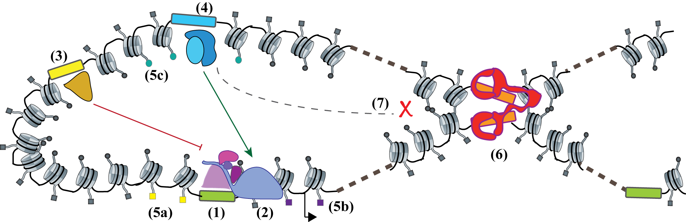
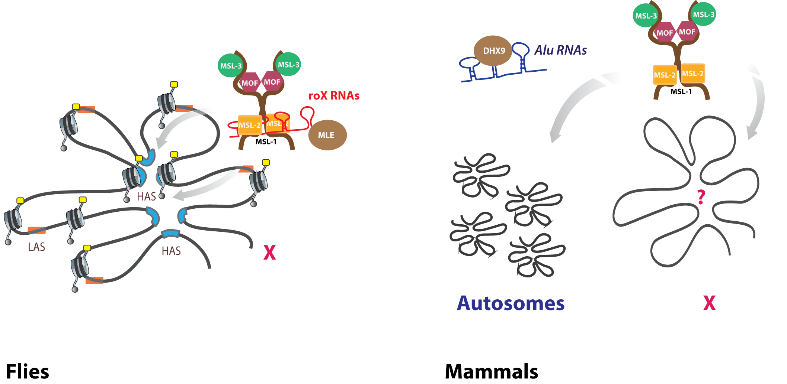
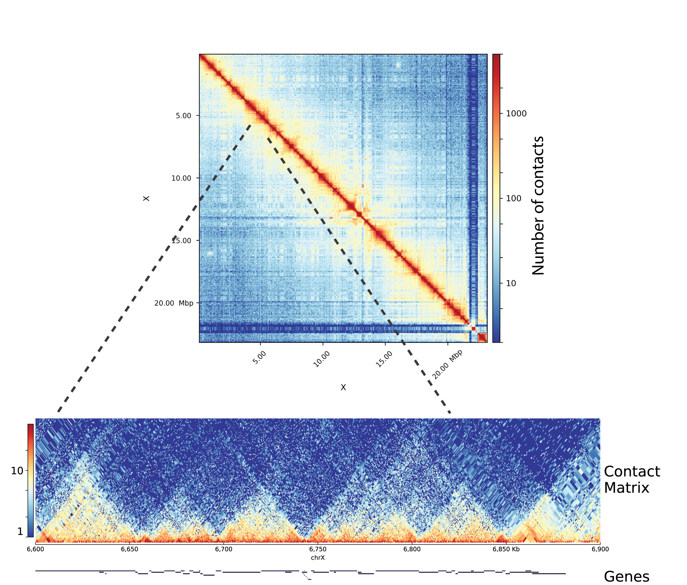
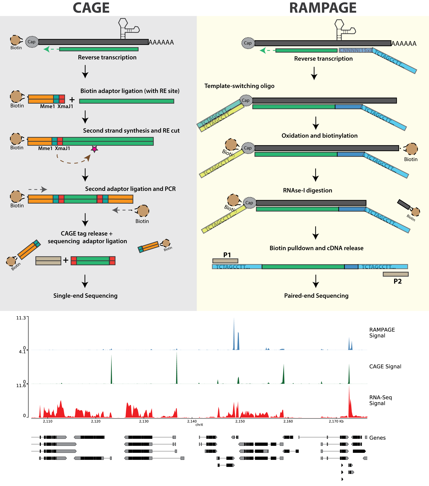

# Introduction

Proteins and Nucleic acids (DNA and RNA) are the fundamental building
blocks of all life on earth. The famous "central dogma" of life,
proposed by Francis Crick ^1^ states that there is a sequential flow
of information from nucleic acids to proteins, and not backwards. No
exceptions to the crick's definition of central dogma has been observed
till date. However, research done before and after the proposal of
central dogma has established that this flow of information could be
regulated, either through nucleic acids themselves, or through proteins.

A "gene" is the major component of central dogma. The overall definition
of a gene has been debated and revised to include protein-coding genes,
regulatory elements such as "promoters" and "enhancers", and regions
that produce non-coding RNAs ^2^[] ^3^. A protein-coding gene
transfers it's encoded information into the protein product, through
"transcription", and "translation" (Appendix B). DNA elements that
regulate this flow of information (or "expression"), such as promoters
or enhancers, are stably inherited through generations and contribute to
evolution ^4^. Apart from DNA elements, other factors such as
semi-stable modifications to DNA elements (eg. methylation), non-coding
RNAs (eg. antisense RNA ^5^, micro-RNA ^6^, long non-coding RNA
^7^ etc.), proteins that interact with DNA (histone marks,
transcription factors), and proteins that interact with mRNA ^8^ also
regulate gene expression. Many of these gene regulatory mechanisms are
established either in response to environmental changes or through
genetic programming, and in some cases, could be stably maintained
through cell cycle, or across multiple generations. Such mechanisms are
collectively studied under the term "epigenetics" ^9^.

In order to understand the regulation of gene expression, it's important
to study how various genetic and epigenetic regulators interact with
each other. Advances in next generation sequencing (NGS) ^10,11^ have
allowed us to study these interactions at multiple scales, ranging from
local gene neighborhood to overall organisation of a chromosome. In the
following sections, I would discuss the various scales of gene
regulation, as well as current state of the art techniques to study
them.

## Multiple scales of genomic regulation

### Local scale : DNA elements, histone marks and transcription factors

The "selected effect" definition of biological function ^12^ implies
that all functional elements should be under some sort of selective
pressure. The primary evolutionary analysis of mammalian genome
therefore proposed \~5% of human-mouse genome to be functional ^13^.
This estimate, which was already about 4-times larger than the
protein-coding fraction ^14^), was further expanded in later analysis
^15,16^. Genome-wide analysis have also proposed "biochemical
function" for many new genetic elements ^17^. Most of these non-coding
DNA elements such as promoters, enhancers, silencers, insulators and
transposons, have been classically known to be involved in regulation of
protein-coding genes ^18^ (Table-1).

It has become increasingly clear that DNA elements do not act alone, but
rather within the influence of the histone code ^19^. In fact various
evidences suggest that gene regulation happens via a cross-talk between
transcription factors, DNA elements, DNA modifications (such as
methylation) and histone marks. For example, during embryonic
development, pluripotency genes Oct3/4 are switched off in a multi-step
process where first a repressor binds to it's promoter, turning off
transcription, followed by recruitment of histone methyltransferase and
histone deacetylase enzymes leading to transcriptional repression and
H3K9 methylation. This follows binding of DNMT3A and DNMT3B
methyltransferases, leading to promoter methylation and ultimately gene
suppression ^20,21^. Apart from this cross-talk, the physical distance
between regulatory elements and their targets also influence gene
expression. Chromatin marks such as H3K9 methylation could spread into
large domains, while TFs are suggested to induce looping of chromatin in
order to achieve spatial proximity to their target genes ^22^. This
looping is regulated via insulators, adding additional layer to gene
regulation.

```{r, echo=FALSE, out.width='80%', fig.align = 'center', fig.cap = '(ref:fig1)', fig.scap='Regulation of gene expression by various genetic and epigenetic elements'}

```

(ref:fig1) ***Regulation of gene expression by various genetic and epigenetic elements** A promoter (1) recruits RNAP-II (2) to perform transcription of target genes. Elements such as repressors (3) or enhancers (4) could recruit transcription factors that either suppress or activate gene expression. All these elements are marked by various histone marks, such as H3K4me3 at promoters (5a) H3K36me3 at gene bodies (5b) or H3K27ac at enhancers (5c), which facilitate gene expression. Insulators (6) recruit proteins that facilitate DNA looping, and block transcription factors from activating genes outside of the established boundaries (7).*

### Global scale : Loops, TADs, and compartments

Looping of DNA has been shown as the mechanism behind long-range
enhancer-promoter interactions in early 1990s ^23^. Since then,
various techniques have been developed to study long-range interactions
via chromatin looping (see section on analysis of chromosome
conformation). Genome-wide derivation of the chromosome conformation
capture (3C) technique, called HiC ^24^ is currently the most popular
amongst those. Early HiC studies were limited by their resolution, and
therefore discovered higher-order chromatin structures called
compartments ^24^ and chromatin domains, referred as topological
associated domains (TADs) ^25^. Later studies revealed that the
chromatin is hierarchically organized, where the domains with similar
chromatin signature are spatially clustered. At the highest level of
clustering, genome can be divided into A and B compartments, which
separate inactive and active chromatin in the cell ^24^. Compartments
could further be segregated into subcompartments that represent
clustering of histone marks ^26^. TADs serve as the next (lower) level
of this segregation, while enhancer-promoter loops are at the lowest
level. Functionally, TADs were shown to act as "regulatory units" or
"insulated neighbourhoods", limiting enhancer-promoter interactions and
the spread of chromatin marks ^27^. This property of TADs resembles
those of insulators, and in fact several classically studied insulator
proteins were found to be associated with TAD boundaries ^28^.
Interestingly, unlike loops, which show cell-type specific interactions
^29^, TADs have been indicated to be cell-type invariant and
evolutionarily conserved ^25,30^.

```{r, echo=FALSE, out.width='80%', fig.align = 'center', fig.scap='Proposed functions of TADs in the genome', fig.cap='(ref:fig2)'}
knitr::include_graphics("figures/intro_fig2.png")
```

(ref:fig2) ***Fig 2. Proposed functions of TADs in the genome.** TADs serve as regulatory units by providing insulated neighbourhoods for enhancers to activate their target genes (1), blocking the enhancers from activating the off-target genes (2), regulating the spread of chromatin marks in cis (3) and blocking the antisense transcription from encroaching into nearby genes (4). Figure inspired from the review by Dixon et al. (2016) ^27^*

Due to high-paced technology development, last few years have seen a
fascinating advance in our understanding of mechanism of loop and TAD
formation. The first study performed using in-situ HiC visualized loops
as regions of enriched contacts between long distance loci, and
identified the insulator element CTCF, on loop anchors ^26^. The loop
anchors associated with cohesin subunits RAD21 and SMC3, along with CTCF
motifs oriented in convergent direction corroborating previous evidences
on the role of CTCF and cohesin in mediating DNA looping ^31^. Several
models of loop formation have been proposed ^32^. However, the
"extrusion-model" proposing loop formation via DNA loop-extruding smc
complexes (cohesin and condensin) has received most evidence, and this
model could also explain the 3D genome structure observed with the HiC
data ^33--35^. Also, the *in-silico* models produced by the Mirny lab
have proposed loop extrusion as a common mechanism behind formation of
loops, TADs and chromosomal compartments ^36--38^. Despite all the
*in-silico* evidence, the *in-vivo* evidence liking extrusion to loop
formation was lacking, until the studies perturbing loop-associated
factors emerged. A depletion of CTCF eliminated CTCF associated loops in
the genome ^39^, while the depletion of cohesin eliminated all loop
domains ^40^. A CRISPR mediated knockout (KO) of the cohesin release
factor WAPL showed that the duration of association of cohesin complex
(SCC2/SCC4) determines the length of loops ^41^. These studies
reinforced a common mechanism behind loop and TAD formation. However,
interestingly they also showed that compartments as well as histone
marks remain unaffected upon loop depletion, suggesting an independent
mechanism behind segregation of compartments. Another interesting point
about studies linking cohesin and loop extrusion is that they don't
explain how cohesion physically extrudes chromatin, since no *in-vivo*
extrusion activity of cohesin complex has been visualized ^42^.
Another smc associated protein, condensin, however, has been shown to
have the motor activity ^43^ and recently, it's *in-vivo* loop extrusion
activity has also been visualized ^44^.

Single molecule imaging suggests that although cohesin can undergo rapid
diffusion along DNA, its mobility is highly restricted by nucleosomes,
and the DNA motor proteins can readily push cohesin along DNA ^45^. On
the same line, transcription has been proposed as a mechanism behind
cohesin mediated loop extrusion ^42^. HiC studies showed that
housekeeping genes are enriched at TAD boundaries ^25,46^ providing
further evidence linking transcription and TADs. A study last year
showed that TADs could emerge in absence of transcription in flies,
challenging the speculation of a causal link between transcription and
TAD formation ^47^, however another recent study showed that
transcription could affect 3D genome structure by displacing cohesin
from CTCF sites ^48^. Therefore, more research to investigate the
association between transcription and 3D genome would be required.

### Mammalian X-inactivation : an interplay between multiple levels of epigenetic regulation

The process of mammalian X-inactivation (XCI) serves as an excellent
example of how multiple levels of epigenetic regulations act in
synchrony and influence each other. mammals (as well as *Drosophila*)
have XX-XY form of sex determination, leading to an imbalance of
X-chromosome gene dosage between sexes. This imbalance is corrected by
an epigenetic phenomenon (dosage compensation) where one of the female
X-chromosome is randomly inactivated during differentiation ^49^. In
mouse, XCI happens in two waves, an imprinted paternal XCI is
established at 4-8 cell stage, and the paternal X remains inactive in
trophectoderm but is reactivated in the inner cell mass of the
blastocyst (ICM) ^50^. This is followed by the random XCI, which
coincides with the down regulation of pluripotency factors such as
Nanog, Oct4/Pou5f1 and Sox2 ^51^. The embryonic stem cells (ESCs)
derived from the ICM, serve as a good model to study XCI, since XCI can
be achieved simply by inducing ESC differentiation ^52^.

The X-inactivation center (Xic) is a locus on X-chromosome which is
required to trigger XCI ^53^. Xic contains the non-coding RNA Xist,
which coats the inactivating X-chromosome during XCI. Xist is negatively
regulated by it's antisense RNA Tsix, or positively regulated through a
ubiquitin ligase Rnf12, in a dosage sensitive manner ^54^, both of
which are controlled by the pluripotency factors ^55,56^. On Xic,
multiple putative regulators of Xist, such as Rnf12, Jpx, Ftx and Xpr
have been shown to be important for specific targeting of X chromosome
for the inactivation process (referred as "sensing") ^57^. The
mechanism behind selection of one of the two X-chromosomes for
inactivation (referred as "choice") remains elusive, although in mouse,
Tsix has been suggested to be important for the process. One proposed
mechanism of Tsix action could be that transient pairing of X-chromosome
during ESC differentiation ^58^ somehow leads to an asymmetry in Tsix
expression, followed by recruitment of repressive chromatin marks
^59^, which in turn leads to asymmetry in Xist expression.

During XCI, the Xist RNA coats the X-chromosome, which results in
depletion of RNAP-II and the activating histone marks, such as H4
acetylation ^60^. The Xist coated chromatin then gets enriched in
repressive chromatin marks such as H2AK119ub, H3K9me and H3K27me3
^61,62^. It's been proposed that Xist silencing followed by H2AK119ub
could in turn recruit PRC1, which could indirectly recruit PRC2 through
Jarid2, bringing in H3K27me3 ^63^. This rapid change of chromatin
state is accompanied by a change in 3D conformation. The X-linked genes
initially reside in nuclear periphery, outside the repressive nuclear
compartment, and get recruited into it during inactivation ^64^.
Ultimately, the inactive-X is condensed to a heterochromatic form, known
as the barr body ^65^. The mechanism of Xist spread has been
investigated using RNA immunoprecipitation (RAP and CHART-seq)
techniques, which suggested that Xist could exploit the chromosome
conformation to spread to regions in spatial vicinity ^66,67^. Due to
this intricate interplay of chromatin, non-coding RNA and chromosome
conformation, that recent studies studying XCI have turned to
multi-assay epigenomic techniques ^68,69^. It's evident that similar
integrative studies would be required in future to study XCI and other
such multi-stage phenomena.

## Regulation of transcription by the MSL complex

### Dosage compensation in flies via the MSL complex

In *Drosophila*, dosage compensation is achieved by the upregulation of
a single X-chromosome in males ^70^. Males absent on first (MOF), an
enzyme that specifically deposits acetylation marks on Histone H4 Lysine
16 (H4K16ac) is required for the process ^71^. MOF associates with the
male-specific lethal (MSL) complex, containing proteins MSL1, MSL2,
MSL3, MLE (maleless) RNA helicase, and non-coding RNAs roX1 and roX2.
roX1 and roX2 are lncRNAs containing stem-loop structures which which
are expressed from the X-chromosome and seem to play a redundant role in
dosage compensation ^72^. The E3 ubiquitin ligase MSL2 is only
expressed in males and, in association with roX RNAs, provides
specificity of the complex towards X-chromosome ^73,74^. Binding
specificity to certain DNA motifs by the MSL2 CXC domain has been shown
to bring X-specificity ^75^. MSL1 serves as a scaffold for binding to
other proteins in the complex, and plays essential role in the assembly
of the complex via its homodimerization and DNA binding property ^76^.
MSL3 enhances the acetylation activity of MOF ^77^ and contains a
chromodomain which facilitates the spread of the complex towards gene
ends ^78^. Finally, the MLE helicase stabilizes the roX RNAs and is
important for it's incorporation into the complex ^79^.

Studies have shown that following this multi-stage assembly process, the
complex is first recruited to certain specific loci in the genome
referred to as high-affinity sites (HAS), followed by further spread to
nearby loci ^80^. Sites of roX RNA expression serve as strong
high-affinity sites. Further, the complex decorates the X-chromosome and
deposits H4K16ac on promoters, gene bodies, as well as intergenic
regions. The increase in H4K16ac has been shown to enhance transcription
^81^. Multiple studies have investigated the precise mechanism of this
transcriptional enhancement using genome-wide techniques such as
ChIP-seq ^82^, GRO-seq ^83^ and nascent RNA-seq ^84^. These
evidences point out that transcriptional upregulation is a joint result
of increased RNAP-II recruitment as well as processivity.

\clearpage

```{r, echo=FALSE, out.width='90%', fig.align = 'center', fig.cap = '(ref:fig3)', fig.scap='Functions of the MSL complex in flies and mammals'}

```

(ref:fig3) ***Functions of the MSL complex in flies and mammals.** 
In **flies**, the MSL complex assembles in presence of the roX RNAs, whose secondary structures are recognized 
and resolved by the maleless helicase (MLE), the complex then targets the 
high-affinity sites (HAS, blue) containing roX. The HAS cluster in 3D space, allowing efficient 
targeting by MSLs. The complex then spreads to low affinity sites (LAS, orange), depositing H4K16ac 
marks (yellow) on the X. In **mammals**, roX RNA is absent and the complex is believed to assemble 
in absence of any RNAs, and targets both X and autosomal sites. Specificity towards X-chromosome, 
as well as the role of chromosome conformation is unknown so far. MLE homolog DHX9 associates with 
a separate class of RNAs and performs independent functions (presented in results). 
Figure inspired from ^88^*

There are interesting parallels between *Drosophila* and mammalian
dosage compensation systems. Both systems rely on an lncRNA expressed
from the X-chromosome, which seem to be important for the recognition of
the chromosome (**sensing**), and both of them rely on a global
deposition of histone marks which associates with suppression or
hyperactivation of genes. In *Drosophila* however, the problem of
**choice** seems to be simplified, since the compensation occurs on the
single male X-chromosome and the male-specific expression of MSL2
assures the sex-specificity. Nevertheless, this similarity suggests that
questions in one species could be tackled by learning from another. For
example, in parallel with the role of chromosome conformation in guiding
the spread of Xist RNA, research performed in our lab and by others have
shown that the spread of the MSL complex on the X-chromosome is guided
by the 3D spatial proximity of HAS ^85,86^. These observations also
lead to further interesting questions. For example, studies have shown
that despite a global inactivation of X-chromosome, about 15% of genes
in humans and a 3% in mice, escape inactivation (referred to as
escapees) ^87^. Escapee biology has been heavily studied in mammals,
however studies to investigate whether different genes might also
respond differently to dosage compensation has been lacking in flies.

### Functions of MOF and MSL complex in mammals

Proteins of the MSL complex are conserved from flies to humans, and
evidence suggests that MOF is responsible for majority of H4K16ac
^89^. Human homologs of MSL1, MSL2, MSL3 and MOF have been
co-purified, suggesting that the bulk of the MSL complex stays together.
It's compelling to speculate that role of MSL complex along with the
role of H4K16ac might have diverged, considering that mammalian dosage
compensation works via a different mechanism, and no ortholog of roX
RNAs have been discovered on the X-chromosome so far ^90^. However,
there is evidence that the active X-chromosome in mammals might also be
upregulated ^91,92^ and a recent study has supported the role of MOF
mediated H4K16ac in enhancing transcription on a subset of X-linked
genes ^93^. Apart from its association with dosage compensation, MOF
mediated H4K16ac have also been implicated in embryogenesis and
oncogenesis ^90,94^. However, this should be noted that MOF is also
associated with another complex, called the non-specific lethal (NSL)
complex, which is conserved from flies to humans, and is involved in
depositing H4K16ac on housekeeping and constitutively expressed genes
^95^. Therefore some functional outcomes of H4K16ac could relate to
the MOF-MSL complex, while others to the MOF-NSL complex ^96,97^.

In flies, the MOF-NSL complex is shown to be responsible for the bulk of
H4K16ac on the gene promoters, while the MSL complex deposits the mark
on gene bodies of the X-chromosome. A recent study from our lab showed
that in mammals, however, MSL and NSL proteins colocalize on promoters
of target genes on both X and autosomes ^96^. The study also showed
that the MSL mediated H4K16ac contributes to the regulation of Tsix
expression and the depletion of MSLs before ESC differentiation leads to
chaotic XCI. However, the lack of specificity towards the X-chromosome
and co-localization with NSL proteins at the promoters raises further
questions about the specific genome-wide role of MSL complex, and its
role on the mammalian X-chromosome.

Apart from the MSL complex, the human ortholog of MLE helicase, DHX9, is
also conserved in mammals, and has been shown to unwind both DNA and
double-stranded RNA ^98--100^. However, in absence of it's association
with MSL complex, the function of it's RNA helicase activity in mammals
had not been studied in detail. A study presented in this thesis
investigates the RNA binding partners of DHX9 in mouse and humans, and
proposes a novel evolved function of DHX9 in suppression of undesired
expression of RNAs ^101^.


## High-throughput techniques to study transcriptional regulation

Due to consistently reducing cost of sequencing, increase in our ability
to multiplex many samples, and sequence genetic material from as low as
a single cell, a large number of biologists now rely on genome-wide
assays for their research. Researchers have quickly realized that the
ability to store, process, analyze, interpret and visualize such
datasets would become a major challenge for biology ^102^. Below I
would focus on recent developments in techniques employed in study of
protein-DNA interactions, chromosome conformation and transcription.

### ChIP-seq : current standards and challenges

Chromatin Immunoprecipitation followed by sequencing (ChIP-seq) is the
broadly used method to detect genome-wide protein-DNA interactions in
cells ^103^. ChIP-seq allows us to probe genome-wide binding sites for
TFs, or study the distribution of histone marks. It has led to numerous
discoveries and has been used by large consortia such as ENCODE, to map
cell-type specific regulatory elements such as enhancers in the human
genome ^17^. ChIP-seq experiment involves DNA protein cross-linking
(using UV or formaldehyde), chromatin fragmentation (using sonication or
enzymes), purification of protein-DNA crosslinks with or without
antibody (called "ChIP" and "Input" DNA), and high-throughput sequencing
of associated DNA. Since the technique involves cross-linking, shearing,
and affinity based pull-down, the data obtained from the protocol is
directly affected by three major factors : 1) **cross-linking
efficiency** of proteins might be affected by its nature of DNA binding
(direct vs indirect, transient vs stable) 2) **Stability** of the
protein epitope under shearing and washing conditions would affect
enrichment and 3) **Antibody cross-reactivity** would result in
detection of non-specific interactions ^104,105^. Variations of
ChIP-seq protocols as have been developed to tackle biases, such as
MNase-ChIP ^106^, to account for shearing and stability bias, and
DamID-seq ^107^ to account for antibody bias. Further variants such as
iChIP ^108^, Mint-ChIP ^109^ and RELACS ^110^ aim to increase the
multiplexing ability and allow reducing the number of cells. Such
methods might receive more popularity in future.

The analysis of ChIP-seq data involves mapping of sequenced DNA to a
reference genome, and detection of regions enriched in ChIP DNA (called
as "Peaks") using Input DNA as a negative control. Peaks represent the
"detected" binding sites of the TF or histone mark of interest. These
peaks are then used to find DNA binding motifs for TFs, detect target
genes of interest, and integrate these results with other assays (such
as RNA-seq) to understand gene regulation ^111^. Apart from the
sources of bias described above, the sequencing depth or genomic
nucleotide content (GC bias) could lead to sample-specific bias in
ChIP-seq, and various "normalization" methods have been developed to
account for such biases ^112--115^. Our group previously developed
"deepTools" ^116^, a set of tools that allow users to identify biases
and perform such normalizations, and visualize the downstream results in
a user-friendly manner. However, due to improvements in experimental and
analysis methods, new challenges have emerged as previous issues have
been resolved. Specifically, increase in multiplexing ability has
simplified performing routine large-scale experiments ^110^, and the
demand for user-friendly tools for differential ChIP-seq analysis
between conditions ^117^, quantitative normalization using external
controls ^118,119^, and large-scale processing and integration of
datasets has been increasing. The development of tools that allow
multi-sample comparison and integration of quality control and analysis
would be widely appreciated. This was the motivation behind our recent
update of deepTools ^120^.

### Analysis of chromosome conformation

Past 10 years have seen lots of development in genome-wide techniques to
capture physical interactions between chromatin loci inside the cell.
The first popular measure to detect chromatin interactions between loci
was called **3C** (chromosome conformation capture). 3C involved
cross-linking the chromatin such that the regions in spatial proximity
inside the nucleus get linked to each other followed by the digestion of
chromatin using restriction enzymes (REs) and the ligation of close-by
DNA fragments. These ligated fragments could then be amplified using PCR
primers specific to the region of interest, followed by qPCR to measure
interaction frequency ^121^. 3C was extended to 4C, where all regions
interacting with a locus of interest (referred to as "bait") could be
detected by inverse PCR using outward facing primers on the 3C-ligated
product, followed by hybridization to a microarray chip to detect
interaction ^122^. The 5C technique introduced later used highly
multiplexed ligation-mediated amplification (LMA) to first "copy" and
then amplify parts of the 3C library followed by detection via
microarrays or sequencing ^123^. Finally the genome-wide version of
3C, called HiC, involved biotin-based pull down of 3C fragments,
followed by library preparation and paired-end sequencing of the
enriched fragments ^24^. An improved version of HiC protocol performs
restriction digestion and ligation of 3C fragments inside intact nuclei,
avoiding non-specific interactions. This technique, referred as in-situ
HiC ^26^ is currently the most popular method for genome-wide
detection of chromatin contacts.

All the 3C-based methods however, suffer from two issues : 1) The
cross-linking of chromatin makes the technique less quantitative and the
proximity ligation introduces additional biases; 2) These methods only
allow detection of pair-wise contacts between two genomic bins. Due to
its limitations and biases, together with the observed discrepancy
between 3C and microscopy-based visualization of interactions, the
interpretation of 3C-based proximity as molecular proximity has been
criticised ^124--126^. Recent innovations in chromosome conformation
techniques, such as GAM ^127^, SPRITE ^128^ and damC ^129^ and
have tried to overcome these limitations. SPRITE is particularly
interesting since it detects multi-loci chromatin interactions via a
relatively simple split-pool barcode tagging of the cross-linked
chromatin fragments, and can also detect DNA-RNA interactions ^128^.
It's not unlikely that one of these new innovations might replace
in-situ HiC as a primary method for analysis of 3D genome.

HiC libraries are sequenced as paired-end, where ideally, one read in a
pair comes from one of the interacting loci in the genome while the
second read comes from another ^24^. However, due to the issues with
ligation efficiency, biotinylation and IP of the interacting pairs, many
"invalid" HiC pairs also get sequenced. Analysis of HiC data begins with
separate **mapping** of the two reads in a pair, followed by pairing and
**filtering** of reads. To consider a pair "valid" two reads should come
from different fragments which were ligated during the protocol, and
therefore should have a restriction site in between them. After
filtering of valid pairs, the genome is divided into bins, and the
number of paired-end contacts between all bins are calculated to create
a HiC matrix.

Initial HiC protocol used whole cell lysis along with REs such as
**Hind-III**, with low cutting frequency, leading to low-resolution HiC
matrices. In contrast, the use of REs with high cutting frequencies such
as **Dpn-II** (4-cutters) combined with other improvements, the recent
in-situ HiC protocols has allowed us to create higher resolution
matrices. In either case, the highest resolution matrices could be
obtained by using restriction enzyme cut-sites as "bins" in the genome
^85,130^.

Several known and unknown factors in the HiC protocol could affect
interpretation of the observed data. Normalization methods have been
developed to explicitly account for some biases, such as the effective
length bias (due to the size of the restriction fragment), GC content
bias, and the mappability bias ^131,132^. However since not all source
of biases are known in the experiments, the matrix balancing methods,
which try to account for both known and unknown biases, have been most
popular ^133^. Matrix balancing methods, such as ICE (Iterative
Correction and Eigenvector decomposition) ^134^, and Knight and Ruiz
method ^26,135^, assume uniform visibility of all genomic loci and
therefore ensure equal sum of row and column values. Both methods have
been shown to be useful in the analysis of HiC data.

HiC interaction matrices reveal that loci which are closer on the linear
genome also tend to interact more frequently. In normal interphase
cells, a distance dependent decay of interactions is observed, which
follows a power law. This interaction is disrupted in mitotic
chromosomes, which represent a reduction of short-range and an increase
in long-range interactions ^136^. It also served as a quality control
signal for the comparison of normal samples. However, the interaction
frequency could also get exaggerated due to nonspecific proximity
ligation effects, and therefore for some analysis, such as detection of
chromosomal compartments, a correction of proximity ligation effect is
needed in addition to ICE correction.

```{r, echo=FALSE, out.width='80%', fig.align = 'center', fig.cap='(ref:fig4)', fig.scap='Visualization of a normalized HiC contact matrix'}

```

(ref:fig4) ***Visualization of a normalized HiC contact matrix.** The HiC
matrix **(top)** represents all-to-all contacts between bins in the
genome, and is therefore symmetric. After cutting the matrix from
diagonal and rotating it **(bottom)**, domains (TADs) in shape of
triangles become visible.*

Normalized HiC matrices could be used for detection of TADs, loops,
compartments, modeling of 3D genome and visualization of genomic
interactions. Numerous software solutions have been developed over the
last few years for the processing and analysis of HiC data that allow
these applications (Table-2). Detection of loops and compartments have
been formalized better than TADs due to their distinct properties. The
original method for detection of chromosomal compartments ^24^ assumes
that regions with shared neighbourhood have correlated interaction
profiles. It therefore transforms the HiC matrix into a correlation
matrix, followed by partitioning of chromosomes into regions of
correlated interactions using principal component analysis (PCA). This
method has now been implemented in multiple tools (Table-2). The method
used for genome-wide detection of loops utilizes high-resolution in-situ
HiC data and searches for clusters of matrix entries with enriched
interactions relative to a local background. This method referred to as
HiCCUPs ^26^, has been implemented in the Juicer pipeline ^137^.

Methods for detection of TADs have been evolving fast over the last few
years. The first group describing TADs ^25^, observed that within a
TAD the bins closer to the boundary have a high interaction bias towards
bins in the middle. They developed a metric that quantified the contacts
of a bin with a larger region upstream (A) and downstream (B) of that
bin and compared it to the contact probability expected under a null
distribution of (A+B)/2 . This directionality index (DI) was used as an
observation to infer the true directionality bias via a hidden markov
model (HMM), which predicted the topological domains. Later, methods
based on maximum likelihood segmentation ^138^, breakpoint detection
^139^, and hierarchical clustering ^140^ were developed. In
principle, all these methods formalize the observation that TADs are
visualized as domains of enriched contacts relative to their
neighbourhood on a HiC matrix, and try to produce the most similar set
of predictions corresponding to this visual observation. Multiple
studies showed that genome organization is hierarchical, and TADs have
been speculated to be the level of this hierarchy which are not
structurally, but rather functionally privileged ^140,141^ . Therefore
ideal methodology for TAD detection has still not been settled, and the
benchmarking of TAD calling methods rely on visual identification of
true positives ^142^.

### Transcript profiling methods and analysis

Transcriptomics (study of all transcripts in the cell), has been one of
the most popular fields where NGS is being applied. The most widely used
bulk RNA-seq methods (studying a population of cells) are poly-A or
ribo-depleted RNA-seq. In **poly-A** RNA-seq, oligos are used to enrich
for mRNA (containing poly-A tails) while in **ribo-depleted** RNA-seq,
all RNAs (except ribosomal RNA) are sequenced ^143^. Ribo-depleted
RNA-seq allows for analysis of poly-A along with non poly-A RNA, such as
unprocessed transcripts and RNAP-III transcribed RNAs. However,
detection of all kinds of RNA requires a high depth of sequencing, the
capacity of sequencing library to capture transcripts various lengths,
and enough input material from the cells to avoid RNA composition effect
(masking of lowly expressed transcripts by abundant RNA). Methods have
been developed to enrich for specific RNA species in the cell, such as
small (\<50 nt) RNAs ^144^, transiently transcribed RNAs ^145^ , and
circular RNAs ^146^.

The analysis of RNA-seq data ^147^ includes **trimming** adaptors and
low quality bases from single or paired-end reads, followed by
**mapping** of the reads to a reference genome. Genomic mapping of
RNA-seq requires splice-aware alignments (allowing for splitting of
reads mapping to splice junctions, in order to map across introns). In
order to obtain the estimate of transcript numbers in the cells,
counting and **summarizing** of reads is performed afterwards, using
gene annotations as reference. Usually, RNA-seq is performed on multiple
biological **replicates** of two or more groups (control vs knockdown,
tissue 1 vs tissue 2 etc.), in order to find genes or transcripts that
vary significantly between the groups (called **differential
expression** analysis). Differentially expressed genes are used to look
for functional enrichments of gene categories using methods like Gene
Ontology (GO) analysis ^148^. Gene level differential expression
analysis has been standardised in the field, while methods for
quantification and differential expression of transcript isoforms are
still under active research ^149^. A special case of differential
expression is where a large number of transcripts are affected, such as
knockdown of TFs regulating housekeeping genes, or genome-wide
transcriptional activation/repression ^150^. These cases require
normalization using external, non-changing controls referred to as
**spike-ins** ^151^. For special applications of RNA-seq such as
detection of **circular RNAs**, the mapping and summarization of reads
requires an entirely different strategy, and various tools have been
developed to facilitate this ^152^. Another special application of
RNAseq is for the identification of **RNA editing** ^153^, which
require stringent mapping and variant detection followed by multiple
rounds of filtering. Due to evolving standards, these applications still
rely on custom analysis.

Although RNA-seq has helped with genome-wide annotation of transcripts
in the genome, it requires fragmentation of RNA, making it difficult to
accurately detect transcription start sites (TSSs) and perform promoter
profiling. Techniques for promoter profiling, such as Cap Analysis of
Gene Expression (**CAGE**) exploit the fact that RNAP-II adds a
methyl-Guanosine cap to the 5'-end of the transcript, and perform the
biotinylation and RNAse digestion to purify full length cDNA ^154^.
The cDNA is fragmented to later purify a short tag around the 5' start
site, followed by sequencing. The sequenced tags, which are short
(\<50bp) and single-ended for most protocols, are then mapped to
reference genome and the promoters are identified using clusters of
tags. Even though promoter-profiling protocols capture the expression
from the RNAs similar to RNA-seq, the correlation between gene
expression estimates obtained from RNA-seq and promoter-profiling
methods has historically been low ^155^. Also, unlike RNA-seq there
has been absence of biological replicates from most CAGE experiments,
and current CAGE analysis tools do not provide the ability to use
replicates for differential expression analysis, limiting the use of
this assay in promoter profiling.

\clearpage


```{r, echo=FALSE, out.width='80%', fig.align = 'center', fig.cap = '(ref:fig5)', fig.scap='Overview of popular promoter-profiling methods and the resulting data'}

```

(ref:fig5) ***Overview of popular promoter-profiling methods and the
resulting data.** **CAGE** begins with biotinylation and pull-down of
RNA, followed by reverse transcription and fragmentation of cDNA using
restriction enzymes (REs) to produce short (21 bp) tags. **RAMPAGE** on
the other hand, uses template-switching oligos containing sample
barcodes and PCR primers before biotinylation and pull-down, cutting
several steps from the traditional design. Both protocols produce sharp
signal at gene promoters (TSS), in contrast to to RNA-seq (red) which
produces signal all over the gene body. Illustrations inspired by
^156^ and ^157^.*

The earliest methods to identify promoters combined CAGE tags with
overlapping 5' start site into a group called **CTSS** (CAGE Tag Start
Sites), and the CTSS overlapping with each other were grouped into **tag
clusters** ^158^. However, this approach (referred as "**distclu**")
used an arbitrary cutoff to avoid overlap between nearby tag clusters,
which does not necessarily correspond to cluster shape. Another method
(referred to as "**paraclu**"), identifies tag clusters as the segments
of genome that maximise the density of CAGE tags per nucleotide within
them ^159^. Clusters at various scales could be produced by varying
the minimum density (***d***) parameter, where small values of *d*
produce large, loose clusters, while large values of *d* produce small,
dense clusters. The algorithm finds all clusters for all values of *d* ,
and therefore reports subclusters (peaks within peaks) of TSS. Despite
the improvements, the method suffers from the issue that it does not
correct for the sample-specific biases in the protocols. Issues such as
RNA composition effect and capture efficiency of CAGE tags introduce
background noise, and affect the detection of robust, reproducible tag
clusters. Another method called **reclu** tries to filter detected
clusters based on irreproducible discovery rate (IDR) method ^160^.
Nevertheless, methods that allow detection of robust tag clusters by
using information from biological replicates would further improve the
analysis.

## Aims

The overall goal of my studies was to perform analysis and integration
of epigenomics and transcriptomics data, specifically ChIP-seq, HiC,
RNA-seq and CAGE, in order to understand the function of the
male-specific lethal (MSL) complex in flies and mammals.

In order to achieve the above goal, several bioinformatic challenges
discussed before needed to be addressed. The overall goal of the thesis
could therefore be divided into three components:

1.  Developing methods for high-resolution analysis of HiC data in order
    to understand the relationships between chromosome conformation
    and gene regulation in flies that can be applied to understand the
    mechanism of action of MSLs.

2.  Improving existing methods of analysis of promoter profiling in
    order to perform high-resolution analysis of MSL-mediated dosage
    compensation on the X-chromosome in flies.

3.  Finally, developing workflows for quality control, analysis and
    integration of data from multiple epigenomic assays, specifically
    in an allele-specific manner, and utilize them to understand the
    function of MSLs on the X-chromosome in mammals.
