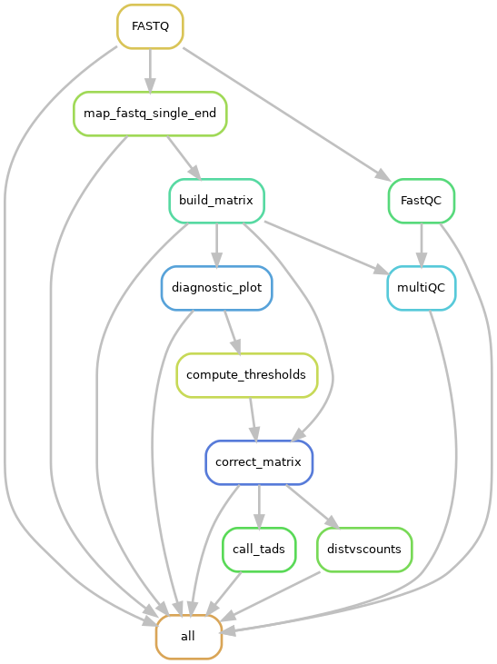
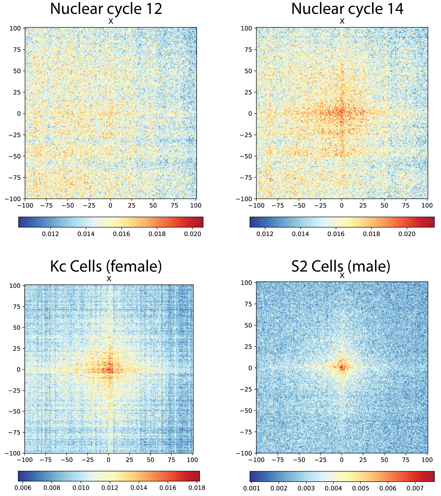
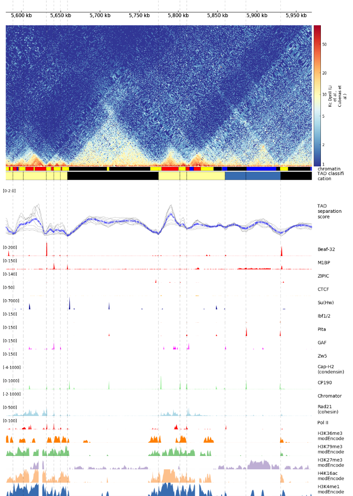
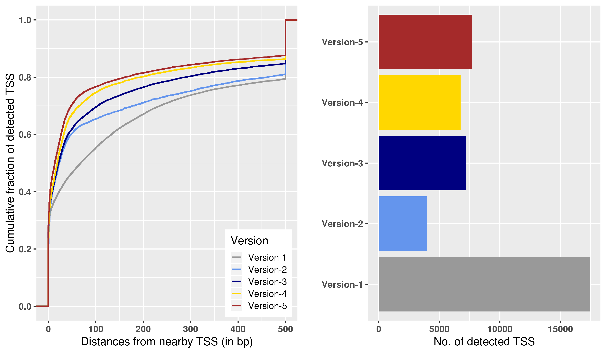
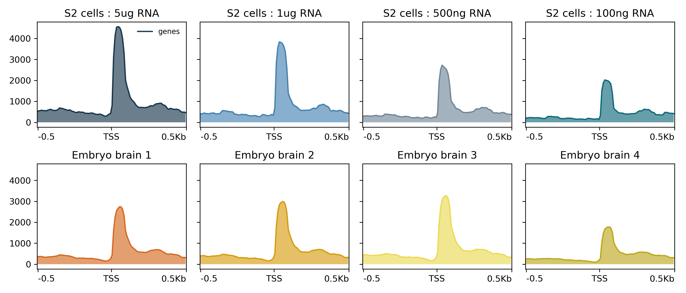
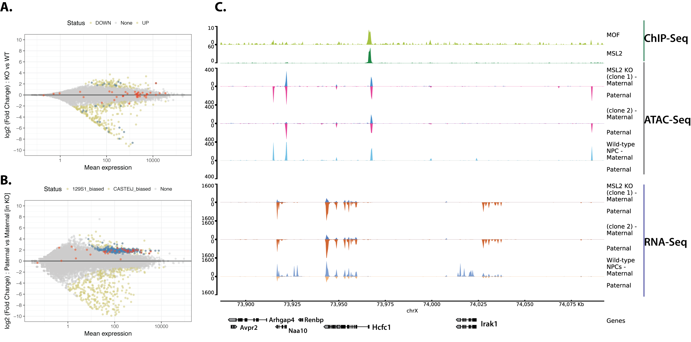
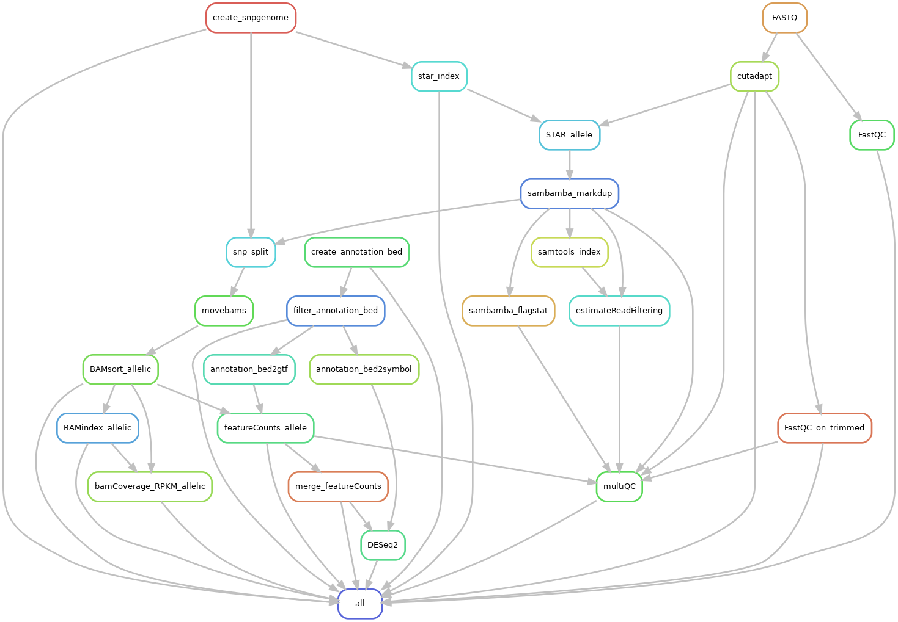

Results and Discussion
======================

The following chapter summarizes the methods and insights from the six
manuscripts presented in the appendix of this thesis.

**Appendix A.1** corresponds to **Ramirez and Bhardwaj et. al (2018)** where we
perform high-resolution analysis of online Hi-C datasets in flies and
explore the relation of chromosome conformation with regulatory elements
and transcription. We also introduce our tools and resources for HiC
analysis.

**Appendix A.2** corresponds to **Wolf et. al (2018)** which describes
implementation of our HiC analysis tools into a Galaxy web-server for
end-to-end HiC analysis.

**Appendix A.3** corresponds to **Bhardwaj and Semplicio et. al (2018)** where
we introduce a new experimental protocol and analysis software for
promoter-profiling, and apply them for the analysis of dosage
compensation in flies. Experimental data for this manuscript was
generated by Giuseppe Semplicio.

**Appendix A.4** corresponds to **Aktas and Ilik et. al (2017)** where we
describe the function of mammalian ortholog of MLE (DHX9) in controlling
genome-wide RNA processing defects mediated by Alu transposons in
humans. Experimental data for this manuscript was generated by Tugce
Aktas and Ibrahim Ilik.

**Appendix A.5** corresponds to **Ramirez and Ryan et. al (2016)** which
introduces an upgrade the previously published toolkit from our group
"deepTools", expanding it's scope to various epigenomic and
transcriptomic assays.

**Appendix A.6** corresponds to **Bhardwaj and Heyne et. al (2018)** which
introduces "snakePipes", a set of scalable and flexible pipelines that
simplify integrative analysis of epigenomic data.

## Insights from high-resolution chromosome conformation analysis in flies

Previous study from our lab investigated the conformation of the male
X-chromosome in flies in order to understand the mechanism of targeting
of the MSL complex ^161^. Fidel Ramirez, Thomas Lingg and others
generated HiC profiles in *Drosophila* S2 cells using the Hind-III RE,
and produced HiC matrices at an average resolution of 4.5 Kb, using the
Hind-III cut-sites in the genome as bins. Analysis of this data revealed
that MSL2 bound high-affinity sites cluster together on 3D space on the
X-chromosome, facilitating the spreading of the MSL complex. During the
study read filtering, matrix generation and normalization using ICE
method ^134^ was implemented by Fidel in a command line tool called
HiCExplorer.

Studies published later ^162,163^ performed HiC using the 4-cutter
Dpn-II enzyme. This data, combined with the ability of HiCExplorer to
create matrices at restriction fragment (RF) resolution, allowed us to
study the Fly genome at sub-kilobase resolution (\~570 bp) and further
understand the relationship between DNA elements, chromosome
conformation and transcription ^164^.

### Setup of a HiC analysis workflow

In order to facilitate high-resolution analysis of HiC data, we first
improved the TAD calling method described in ^161^ (see details in
^164^). Specifically, 1) The original matrix is transformed into a
z-score matrix before calculating the TAD-separation score 2) For each
bin in the genome, the TAD-separation score is calculated for multiple
window sizes around the bin and averaged to reduce noise 3) After
identification of bins with "local minima" of TAD-separation scores, a
Wilcoxon rank-sum test is performed to compare the distribution of that
bin with the nearby (left and right) regions, followed by multiple
testing correction.

```{r, echo=FALSE, out.width='50%', fig.align = 'center', fig.cap='(ref:figr1)', fig.scap='A directed acyclic graph (DAG) of the HiC workflow'}

```

(ref:figr1) ***A directed acyclic graph (DAG) of the HiC workflow.** It includes
FASTQ file quality controls (FastQC) mapping, matrix generation, QC
plots, matrix correction and TAD detection. The step marked as "all"
collects the final outputs. This workflow has been implemented in
snakePipes (see last section).*

I utilized HiCExplorer to create an end-to-end HiC analysis workflow
implementing various analysis steps (see Introduction). Computational
workflows are like automated protocols that perform a series of analysis
steps, ensuring that dependencies between steps are properly resolved
(for example, re-running a 5-step workflow with a missing file at step-4
re-runs both step-4 and 5 to ensure that dependent files are updated).
Workflows, combined with containerization (each step running in it's own
virtual environment) ensure the transferability and reproducibility of
analysis results ^165^. This HiC workflow could be utilized for
reproducible analysis of both in-house and online HiC datasets (Fig 1).
This workflow is now implemented in our epigenomic analysis toolkit
called snakePipes, and is routinely used in-house for HiC data analysis.

### Relationships between TADs, regulatory elements, and transcription in flies

Using the newly implemented version of HiCExplorer tools, we detected
\~2800 boundaries in wild-type female *Drosophila* Kc cells, and found
that most (77%) of the TAD boundaries in flies associate with gene
promoters. These promoter boundaries associate with active chromatin and
have higher DNAse hypersensitivity signal (from DHS-seq data) and
stronger TAD-separation score than non-promoter boundaries. A carefully
performed DNA motif enrichment analysis discovered that
promoter-boundaries are enriched with a specific set of core-promoter
motifs : motif-1 (M1BP), 2 (Beaf32), 6, 7 (ZIPIC) and 8, while
non-promoter boundaries are enriched for some classically known
insulator motifs : CTCF, Ibf and Su(Hw). Interestingly, we find that the
motifs combinations, rather than the number of motif instances seem to
affect the strength of boundaries. Certain motifs combinations, such as
Beaf32 + Pita make the boundaries stronger while others, such as Su(Hw)
+ ibf make them weaker. Our study also challenged the previous studies
showing that the number of ChIP-seq peaks of the insulator proteins
correlate with boundary strength, and rather emphasised the usefulness
of considering motifs at boundaries.

To understand whether there exists a genetic code at boundaries, we used
various classification methods, such as logistic regression, random
forest and gradient boosting models to predict boundaries using DNA
motifs. These methods performed similarly well in identifying
boundaries, with a sensitivity and specificity of over 70% on an
independent test data. Interestingly the classifiers showed that DNAse
hypersensitivity is the most important feature in boundary prediction,
suggesting that the accessibility of DNA motifs might be a crucial
factor for boundary formation.

Using re-analysis of RNA-seq data from modENCODE, we investigated the
relationship between our high-resolution TADs and transcription. We find
that TADs serve as units of coordinated transcription during
*Drosophila* development. Expression of genes with TADs are highly
correlated throughout development while genes separated by TAD
boundaries show a lack of correlation. We also find that genes at TAD
boundaries have expression features of housekeeping genes (high,
constitutive expression with low variability) which confirmed previous
studies linking housekeeping genes to TAD boundaries.

```{r, echo=FALSE, out.width='70%', fig.align = 'center', fig.cap='(ref:figr2)', fig.scap='The HAS interaction network on X-chromosome'}

```

(ref:figr2) ***The HAS interaction network on X-chromosome.** An aggregate
contact matrix containing mean interactions over all possible contacts
within a genomic distance of 0.5 Mb to 15 Mb of HAS loci. Submatrices
were extracted for each HAS from the corrected HiC matrix, and the
counts were further normalized to total counts of each submatrix. The
data from multiple recent in-situ HiC studies ^47,162--164^, analyzed
during our study.*

The catalogue of high-resolution boundaries generated in this study
functions as useful resource in understanding the biology of MSLs, as
well as other protein complexes in context of 3D chromatin. For example,
chromator, a member of MOF-associated NSL (non-specific lethal) complex
was found to be associated with various motifs at boundaries (Fig. S3I
of ^164^). Further the data produced and analysed during our study
allowed us to re-evaluate our previous finding whether the high-affinity
sites cluster in 3D space. Using clustering of contact aggregates from
the data, we observed that the HAS-HAS clusters emerge after zygotic
genome activation (at nuclear cycle 14, together with the establishment
of TADs) when MSL2 expression begins ^166^. Similar to ^161^,
HAS-HAS clusters were observed in both male and female cells, suggesting
that the MSL complex could utilize the pre-existing 3D conformation of
the X-chromosome for spreading.

```{r, echo=FALSE, out.width='80%', out.height='60%', fig.align = 'center', fig.cap='(ref:figr3)', fig.scap='Chorogenome navigator'}

```

(ref:figr3) **Chorogenome navigator.** Snapshot of a \~350kb region around
MOF in *Drosophila* Kc cells, from the chorogenome navigator web server.*

### Resources for HiC analysis and visualization

During our analysis of chromosome conformation in flies, we improved on
the methods developed and presented in the last study from our lab
^161^. Fidel and I added further functionality to HiCExplorer, such as
improved TAD calling, a method to import and export multiple file
formats, and plotting methods. In collaboration with Jose Villaveces
(MPI-Biochem), we developed the visualization tool HiCBrowser, which can
be used as a standalone tool to browse HiC and other genomic data
(ChIP-seq, RNA-seq etc.). In order to allow biologists to investigate
their own gene or region of interest in context of TADs, we developed a
web server that contains online HiC data pre-processed using our HiC
workflow, along with other genomic data
([[http:://chorogenome.ie-freiburg.mpg.de]{.underline}]). Further in
collaboration with Joachim Wolff and Bjoern Gruening, we implemented
HiCExplorer along with other tools in galaxy, that facilitates GUI based
end-to-end analysis of HiC data for biologists ^167^. We hope that
these resources would facilitate easy and user-friendly HiC analysis for
biologists.


## Using promoter-profiling to study MSL-mediated dosage compensation in flies

### Development of the MAPCap protocol

In flies, we wanted to understand how MSL mediated dosage compensation
works at the level of individual transcription start sites (TSSs),
through promoter-profiling. In collaboration with Giuseppe Semplicio, I
contributed to the development of a new experimental protocol for
promoter-profiling, termed as MAPCap (**M**ultiplexed **A**ffinity
**P**urification of **Cap**ped RNA). MAPCap is performed differently
compared to a standard CAGE protocol, in the following major ways :

1.  Instead of biotinylation of the 5-mG Cap, MAPCap performs an 5-mG
    antibody based pull-down of the transcripts.

2.  Instead of fragmentation using a restriction site inserted during
    RT-PCR in CAGE, MAPCap utilizes sonication.

3.  RNA is attached to an oligo containing multiplexing barcodes, random
    barcodes (as UMIs) and sequencing adaptors, allowing us to pool
    the samples early in the protocol.


```{r, echo=FALSE, out.width='90%', fig.align = 'center', fig.cap='(ref:figr4)', fig.scap='Improvement in TSS detection over different versions of the MAPCap protocol'}

```

(ref:figr4) ***Improvement in TSS detection over different versions of the
MAPCap protocol** (not completely in chronological order). **Left :***
*Distance* *of detected TSS to an annotated TSS. As the protocol
improved, the detected TSS became closes to the annotated TSS in the
genome. **Right :** Number of detected TSS for each version. Version 1
has the highest number of detected TSSs, however the precision plot
shows that it was mostly due to low signal-to-noise ratio. The number of
detected TSSs remains constant for the later versions of the protocol
while the precision improved. All samples utilized 5ug of RNA, and TSSs
were detected in all samples using the "distclu" method with the same
parameters. *

Development of MAPCap protocol required multiple rounds of
optimizations, where the fragmentation, handling of abundant RNAs,
reverse-transcription, and sample multiplexing strategies were changed
in response to the insights from the data analysis. *Figure 3.4* shows how
the TSS detection has improved over the various versions of the
protocol.

An important insight from the development of the protocol has been the
effect of RNA composition bias on the final analysis. In case of
protocols like MAPCap, that allow early multiplexing, the effect of
composition bias is more pronounced, since there are multiple steps
where high abundance RNA can "take over" the overall library
composition. Promoter-profiling is usually performed on ribo-depleted RNA, and the
RNA composition fluctuates for each run, especially for samples derived
from tissues *(Fig. 3.5)*. This emphasised the need for methods to account
for composition bias (such as TMM ^168^), and the usefulness of
replicates in the detection of robust TSSs in presence of noise.


```{r, echo=FALSE, out.width='90%', fig.align = 'center', fig.cap='(ref:figr5)', fig.scap='Effect of RNA composition on TSS enrichment'}

```

(ref:figr5) ***Effect of RNA composition on TSS enrichment** (RPKM normalized
signal on TSS). **Upper** panel shows the data from a MAPCap run where
different input concentrations of RNA were multiplexed. Enrichment
decreases as the amount of input RNA gets lower. **Lower** panel shows
data from a MAPCap run where total RNA was extracted from different
embryos brains. The concentration varies between 200-500 ng per sample.
Lower panel represents a more practical MAPCap run, since the RNA
composition couldn't be precisely controlled.*

### Development of the icetea bioconductor package

The new generation promoter-profiling protocols such as MAPCap, and the
recently introduced RAMPAGE ^157^ protocol demand a set of data
processing steps different from traditional CAGE. The raw FASTQ files
obtained from the protocol contains sample multiplexing barcodes, which
are used to separate the samples, and the random barcodes, which could
be used to remove PCR duplicates during the analysis. The paired-end
data produced by this protocol could be used to improve mapping and
annotation of peaks. Also, multiplexing makes it easier for biologists
to include biological replicates in their experiments, which could be
useful in performing robust TSS detection and downstream analysis (see
introduction). Also, a good correlation between expression estimates
between MAPCap and RNA-seq suggested that after appropriate
normalization, a MAPCap experiment with biological replicates could also
be used for differential TSS expression analysis.

Keeping the above observations in mind, I created a user-friendly R
package called **icetea** (**I**ntegrating **C**ap **E**nrichment and
**T**ranscript **E**xpression **A**nalysis) that performs processing,
TSS detection and differential expression analysis from data such as
those from MAPCap and RAMPAGE. **Icetea** implements a new TSS detection
approach based on "local enrichment" of CAGE tags, that's inspired from
ChIP-seq analysis. It uses replicates to model robust fold-changes of
genomic windows with their local background, and a user-specified
fold-change cutoff is used to detect TSS. Further, **icetea** can be
used to perform various internal (TMM, RLE etc.) or external (spike-In)
normalization of data and detect differentially expressed TSSs between
two conditions. **Icetea** is available for use from bioconductor
([[https://bioconductor.org/packages/icetea]{.underline}]). 

### Transcriptional changes during dosage compensation defects in flies

In order to gain insights into transcript-specific dosage compensation
in flies, we performed MAPCap, together with RNA-seq, on brains
extracted from male and female fly larvae. RNAs were extracted from the
mutants of the *maleless* (MLE) gene, which is required for the
targeting of the MSL complex to X chromosome through recognition of roX
RNAs. Therefore, mutant males are expected to have defects in the
upregulation of the X-chromosome. We then deployed a processing pipeline
based on icetea for the analysis
([[https://github.com/vivekbhr/cage\_pipeline]{.underline}]). Analysis
showed that most promoters are similarly used between male and female
flies. MLE KO leads to a downregulation of majority of TSSs on the
X-chromosome in males ( \>1700 downregulated TSSs), but have almost no
effect on females (\~23 TSSs differentially expressed). Very few (241)
upregulated TSS were observed genome-wide, with only 14 on X-chromosome.
Analysis of wild-type ChIP-seq data on the differentially expressed TSS
showed that both up-regulated and unchanged TSS had similarly high
H4K16ac levels which, while the up-regulated TSS showed low H4K16ac
levels in both sexes. We are further generating H4K16ac ChIP-seq in MLE
KO to investigate the TSS which remain unchanged upon MLE KO in the
MAPCap data in order to understand whether their resistance to change in
promoter usage is dependent on their H4K16ac levels.

\clearpage


```{r, echo=FALSE, out.width='90%', fig.align = 'center', fig.cap='(ref:figr6)', fig.scap='TSS expression (MAPCap) and H4K16ac levels (ChIP-seq) on male and female embryo brains'}
knitr::include_graphics("figures/results_fig6.png")
```

(ref:figr6) ***TSS expression (MAPCap) and H4K16ac levels (ChIP-seq) on male 
and female embryo brains.** Upon KO of MLE, male brains show about
\~2-fold downregulation, while female brains do not show a large change.
Both downregulated and unchanged TSS have similar H4K16ac levels in
wild-type cells (males have higher level than females on the X). The
plot is made using an new version of deepTools ^120^ that allow
creation of coverage files and visualization of data from multiple
assays together.*

## Integrating transcriptomic and epigenomic analysis to study MSLs in mammals

### The role of MSL complex member MLE in mammals

All MSL complex members except the roX RNAs, are conserved from
*Drosophila* to mammals (see introduction) and previous study from our
lab based on ChIP-seq of the MSLs discovered their genome-wide
localization on gene promoters and enhancers ^96^. The role of the
conserved homolog of MLE, termed as DHX9, was however not investigated
in this study. To study the functions of the DHX9 RNA helicase, Tugce
Aktas and Ibrahim Ilik in the lab performed an improved version of
RNA-CLIP : a method used to determine RNA binding partners of a protein
of interest. This method, termed UV-CLAP (Ultraviolet Cross Linking and
Immunoprecipitation) produced genome-wide map of DHX9-RNA interactions,
and the visual inspection of the data revealed that DHX9 seems to
preferentially bind to human Alu elements in the genome.

In collaboration with Tugce and Ibrahim, I performed a genome-wide
enrichment analysis of various Alu subfamilies in the DHX9 UV-CLAP data
using two independent approaches : 1) consensus repeat mappings,
followed by enrichment analysis (adopted from ^169^) and 2)
graph-based clustering of raw DHX9 bound sequences (adopted from
^170^). Both approaches revealed a significant association of DHX9
with Alu repeats in humans, and their evolutionary relatives : B1
transposons in mice. DHX9 was preferentially enriched on young AluS and
AluY families enriched in gene introns. To further investigate the role
of DHX9-Alu interaction in introns, Ibrahim performed RNA-seq experiment
with poly-A selected and poly-A depleted RNA. My analysis of this data
revealed that DHX9 depletion leads to widespread defects in gene
expression and splicing, and an increase in production of circular RNA
species in the cell. Further, since intronic Alu elements are frequently
associated with RNA editing ^171--174^, I developed a workflow for
detection of RNA editing from the RNA-seq data
([[https://github.com/vivekbhr/dhx-alu]{.underline}]). Using the
workflow, we identified both an increase and decrease of RNA editing
genome-wide, although RNA editing explained only a minor fraction of
gene expression changes. Overall, this analysis revealed for the first
time, that DHX9 has a major role in regulating RNA processing defects
contributed by the Alu elements in the human genome ^175^.

### The role of MSL complex on active and inactive mammalian X chromosomes

Probing the function of the MSL complex in mammals, the previous study
from our lab discovered that the differentiation of female mouse
embryonic stem cells (ESCs) depleted for MSL complex members (MSL1 and
MSL2) leads to chaotic inactivation of the X chromosome. A fraction of
these differentiating neural progenitor cells (NPCs) showed both X
chromosomes being inactivated ^96^. This effect of MSLs was attributed
to their regulation of the Tsix promoter through H4K16ac. In order to
further investigate the function of MSLs on the X chromosome, we sought
to 1) generate genome-wide binding profiles of MSLs in female mouse cell
lines 2) Investigate the effect of MSL loss in a system independent of
Tsix effects.

Tomsaz Chelmicki therefore generated ChIP-seq profiles of MSLs in female
ESCs and NPCs derived from a mouse strain of hybrid origin, a cross
between *Mus musculus* (strain 129Sv) and *Mus castanious* (Cast)
^176^. To study effects independent of Tsix, Raed Hmadi generated KOs
for MSL2 in the NPCs, where X-inactivation has already been established.
We then generated RNA-seq profiles of these KO clones, along with the
wild-type controls. Further, in collaboration with Laura Arrigoni and
Ralf Gilsbach, we generated profiling of various histone marks using
RELACS ^177^, open chromatin profiling using ATAC-seq ^178^, and
whole genome methylation profile using bisulfite-seq (WGBS) ^179^ on
wild-type and KO NPCs.

For analysis of these datasets we needed an approach of mapping and
sorting of genomic alignments in an allele-specific manner. I utilized
an approach that masks the positions of single nucleotide polymorphisms
(SNPs) coming from parental strains in the reference genome before
mapping, followed by sorting of unique allele-specific alignments. This
method, implemented in the tool SNPsplit ^180^, overcomes the
"reference bias" : an issue that reads coming from a strain that's
genetically closer to the reference genome, would map better to the
reference genome in absence of SNP masking ^181^. Workflows for
analysis of epigenomic data that could perform allele-specific sorting
were developed (see next section) and applied for the analysis of MSL2
KOs.


```{r, echo=FALSE, out.width='100%',  out.height='40%', fig.align = 'center', fig.cap='(ref:figr7)', fig.scap='Integrative analysis of ChIP-seq, RNA-seq and ATAC-Seq in MSL2 knockout (KO) NPCs'}

```

(ref:figr7) ***Integrative analysis of ChIP-seq, RNA-seq and ATAC-Seq in MSL2
knockout (KO) NPCs.** **A)** The MSL2 bound genes on X-chromosome
(marked in red) seem to be unaffected in normal RNA-seq analysis. Genes
differentially expressed between KO and Wild-type cells are marked in
green, and affected genes on chrX are marked in blue **B)**
Allele-specific analysis of the data reveals that genes on chrX show a
clear bias in expression towards the paternal allele (blue). Many of
these genes are bound by MSL2 at their promoters (red). **C)** Genome
browser track showing a locus with escapees of Xi, MSL2 KO shows
activation of paternal allele expression, concordant with open chromatin
changes.*

Applying our analysis workflow to MSL2 ChIP-seq data revealed that
after, but not before differentiation into NPCs, MSL2 binds to
significantly more loci on the inactive X-chromosome (Xi), compared to
the active X (Xa). Analysis of RNA-seq data revealed an allele-specific
downregulation of genes associated with MSL2 binding, upon the loss of
MSL2. However the loss on one allele-was compensated by a gain in
expression from another allele. Analysis of ATAC-seq data in the KOs
suggested that this effect is transcriptional, since the promoters
associated with loss of expression show a loss of open chromatin and
vice-versa (Fig. 5). This analysis suggests that MSL2 might be important
for maintaining allelic balance of expression of their target genes.
Further, there seems to be an allelic-sensing mechanism on the
chromosome that compensates for the loss of MSL2 on the target allele.
Further integrative analysis of this data to understand the effects of
MSLs on the X chromosome is underway.

```{r, echo=FALSE, out.width='95%',out.height='50%', fig.align = 'center', fig.cap='(ref:figr8)', fig.scap='A directed acyclic graph (DAG) of the allele-specific RNA-seq analysis workflow'}

```

(ref:figr8) ***A directed acyclic graph (DAG) of the allele-specific
RNA-seq analysis workflow.** *The workflow begins with creation of
dual-hybrid genomes for user-defined strains of interest, and ends with
allele-specific differential expression analysis using a statistical
interaction based design. Optional quality-checks can be performed via
deepTools ^120^ (not displayed here for clarity). This workflow has
been implemented in snakePipes.*

### A toolkit for integrative epigenomic analysis

The analysis of various epigenomic datasets described in the section
above is a massive challenge for a single bioinformatician, and demands
a set of uniform processing pipelines. We sought to develop a pipeline
that would also allow flexible processing of datasets such that future
users are able to change parameters and perform exploratory analysis.
This pipeline should be scalable, to run hundreds to thousands of jobs
at once, and should be easy to install and use for future. I joined the
existing efforts by Steffen Heyne and others in the bioinformatics unit
to develop a toolkit that allows analysis of ChIP-seq, RNA-seq,
ATAC-seq, WGBS, Hi-C and single cell RNA-seq data. This toolkit, called
**snakePipes**, implements various methods and workflows described in
the previous sections, in a user-friendly command-line interface. The
pipeline also performs allele-specific analysis of data as described in
the previous section, upto the point of downstream analysis, such as
differential expression of differential peak detection. With snakePipes,
we hope that biologists would be able to easily replicate the results
from ours and other online studies that present multiple epigenomic
assays ^182^.

## Conclusion and Outlook

Various elements in eukaryotic genome, such as DNA sequences, chromatin
and the 3D topological structure act together to facilitate gene
regulation. Therefore, Integrative transcriptomic and epigenomic
analysis is becoming an important tool to understand genomic regulation.
In this project, I performed analysis of various transcriptomic and
epigenomic assays in order to understand the function of members of the
MSL complex, from flies to humans. To facilitate this, we developed
bioinformatic tools and workflows for analysis of transcription, histone
marks and 3D conformation of the genome. Application of our methods
revealed a catalogue of high-resolution boundaries in flies and their
effect on transcription, the role of MSL complex member MLE and H4K16ac
in promoter usage in male flies, the newly evolved function of MLE
ortholog DHX9 in mammals, and finally an interesting new insight into
the role of the mammalian MSL complex on the X-chromosome.

Future directions in studying MSLs would benefit from further
integration of data. For example, since most TAD boundaries in flies are
associated with promoters, an integration of 3D conformation and
promoter-profiling data could reveal the mechanism of how gene-by-gene
dosage compensation could be established at early embryogenesis via the
spreading of MSL-complex on X. Further, it It would be interesting to
explore the role of chromosome conformation in other scenarios, such as
the recently observed targeting of MSL2 on autosomes ^183^. Unlike
well studied functions of MSLs in *Drosophila*, we have only recently
started to understand the role MSLs in mammals, and in particular, its
difference with the role of another MOF associated complex, the NSLs.
Rigorously designed ChIP-seq experiments in presence of MSL and NSL
knockout controls would be required to avoid antibody non-specificity as
well as to study the dependence of MSL targeting on the NSL complex. Our
understanding of the role of H4K16ac in mammals would also be improved
by studying its relationship with other histone marks. Performing a full
histone profiling upon MSL and NSL depletion would be relatively simpler
now due to the development of highly multiplexed protocols ^110^,
enabling future studies would be able to tackle such question. Further,
development of technologies performing low-cell or single cell
epigenomics has provided new scope to study MSL biology in tissues
during development and differentiation. Methods for analysis of such
assays are yet in their infancy, and therefore would present interesting
challenges to work on in the near future.
