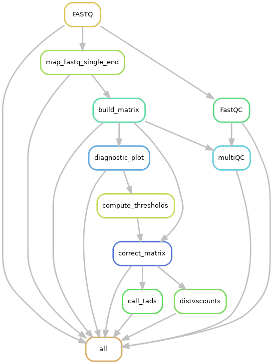
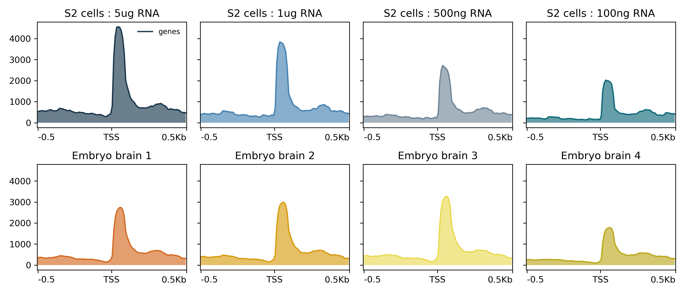

<!--chapter:end:index.Rmd-->

# Introduction

Proteins and Nucleic acids (DNA and RNA) are the fundamental building
blocks of all life on earth. The famous "central dogma" of life,
proposed by Francis Crick ^1^ states that there is a sequential flow
of information from nucleic acids to proteins, and not backwards. No
exceptions to the crick's definition of central dogma has been observed
till date. However, research done before and after the proposal of
central dogma has established that this flow of information could be
regulated, either through nucleic acids themselves, or through proteins.

A "gene" is the major component of central dogma. The overall definition
of a gene has been debated and revised to include protein-coding genes,
regulatory elements such as "promoters" and "enhancers", and regions
that produce non-coding RNAs ^2^[] ^3^. A protein-coding gene
transfers it's encoded information into the protein product, through
"transcription", and "translation" (Appendix B). DNA elements that
regulate this flow of information (or "expression"), such as promoters
or enhancers, are stably inherited through generations and contribute to
evolution ^4^. Apart from DNA elements, other factors such as
semi-stable modifications to DNA elements (eg. methylation), non-coding
RNAs (eg. antisense RNA ^5^, micro-RNA ^6^, long non-coding RNA
^7^ etc.), proteins that interact with DNA (histone marks,
transcription factors), and proteins that interact with mRNA ^8^ also
regulate gene expression. Many of these gene regulatory mechanisms are
established either in response to environmental changes or through
genetic programming, and in some cases, could be stably maintained
through cell cycle, or across multiple generations. Such mechanisms are
collectively studied under the term "epigenetics" ^9^.

In order to understand the regulation of gene expression, it's important
to study how various genetic and epigenetic regulators interact with
each other. Advances in next generation sequencing (NGS) ^10,11^ have
allowed us to study these interactions at multiple scales, ranging from
local gene neighborhood to overall organisation of a chromosome. In the
following sections, I would discuss the various scales of gene
regulation, as well as current state of the art techniques to study
them.

## Multiple scales of genomic regulation

### Local scale : DNA elements, histone marks and transcription factors

The "selected effect" definition of biological function ^12^ implies
that all functional elements should be under some sort of selective
pressure. The primary evolutionary analysis of mammalian genome
therefore proposed \~5% of human-mouse genome to be functional ^13^.
This estimate, which was already about 4-times larger than the
protein-coding fraction ^14^), was further expanded in later analysis
^15,16^. Genome-wide analysis have also proposed "biochemical
function" for many new genetic elements ^17^. Most of these non-coding
DNA elements such as promoters, enhancers, silencers, insulators and
transposons, have been classically known to be involved in regulation of
protein-coding genes ^18^ (Table-1).

It has become increasingly clear that DNA elements do not act alone, but
rather within the influence of the histone code ^19^. In fact various
evidences suggest that gene regulation happens via a cross-talk between
transcription factors, DNA elements, DNA modifications (such as
methylation) and histone marks. For example, during embryonic
development, pluripotency genes Oct3/4 are switched off in a multi-step
process where first a repressor binds to it's promoter, turning off
transcription, followed by recruitment of histone methyltransferase and
histone deacetylase enzymes leading to transcriptional repression and
H3K9 methylation. This follows binding of DNMT3A and DNMT3B
methyltransferases, leading to promoter methylation and ultimately gene
suppression ^20,21^. Apart from this cross-talk, the physical distance
between regulatory elements and their targets also influence gene
expression. Chromatin marks such as H3K9 methylation could spread into
large domains, while TFs are suggested to induce looping of chromatin in
order to achieve spatial proximity to their target genes ^22^. This
looping is regulated via insulators, adding additional layer to gene
regulation.

```{r, echo=FALSE, out.width='80%', fig.align = 'center', fig.cap = '(ref:fig1)', fig.scap='Regulation of gene expression by various genetic and epigenetic elements'}
knitr::include_graphics("figures/intro_fig1.png")
```

(ref:fig1) ***Regulation of gene expression by various genetic and epigenetic elements** A promoter (1) recruits RNAP-II (2) to perform transcription of target genes. Elements such as repressors (3) or enhancers (4) could recruit transcription factors that either suppress or activate gene expression. All these elements are marked by various histone marks, such as H3K4me3 at promoters (5a) H3K36me3 at gene bodies (5b) or H3K27ac at enhancers (5c), which facilitate gene expression. Insulators (6) recruit proteins that facilitate DNA looping, and block transcription factors from activating genes outside of the established boundaries (7).*

### Global scale : Loops, TADs, and compartments

Looping of DNA has been shown as the mechanism behind long-range
enhancer-promoter interactions in early 1990s ^23^. Since then,
various techniques have been developed to study long-range interactions
via chromatin looping (see section on analysis of chromosome
conformation). Genome-wide derivation of the chromosome conformation
capture (3C) technique, called HiC ^24^ is currently the most popular
amongst those. Early HiC studies were limited by their resolution, and
therefore discovered higher-order chromatin structures called
compartments ^24^ and chromatin domains, referred as topological
associated domains (TADs) ^25^. Later studies revealed that the
chromatin is hierarchically organized, where the domains with similar
chromatin signature are spatially clustered. At the highest level of
clustering, genome can be divided into A and B compartments, which
separate inactive and active chromatin in the cell ^24^. Compartments
could further be segregated into subcompartments that represent
clustering of histone marks ^26^. TADs serve as the next (lower) level
of this segregation, while enhancer-promoter loops are at the lowest
level. Functionally, TADs were shown to act as "regulatory units" or
"insulated neighbourhoods", limiting enhancer-promoter interactions and
the spread of chromatin marks ^27^. This property of TADs resembles
those of insulators, and in fact several classically studied insulator
proteins were found to be associated with TAD boundaries ^28^.
Interestingly, unlike loops, which show cell-type specific interactions
^29^, TADs have been indicated to be cell-type invariant and
evolutionarily conserved ^25,30^.

```{r, echo=FALSE, out.width='80%', fig.align = 'center', fig.scap='Proposed functions of TADs in the genome', fig.cap='(ref:fig2)'}

```

(ref:fig2) ***Fig 2. Proposed functions of TADs in the genome.** TADs serve as regulatory units by providing insulated neighbourhoods for enhancers to activate their target genes (1), blocking the enhancers from activating the off-target genes (2), regulating the spread of chromatin marks in cis (3) and blocking the antisense transcription from encroaching into nearby genes (4). Figure inspired from the review by Dixon et al. (2016) ^27^*

Due to high-paced technology development, last few years have seen a
fascinating advance in our understanding of mechanism of loop and TAD
formation. The first study performed using in-situ HiC visualized loops
as regions of enriched contacts between long distance loci, and
identified the insulator element CTCF, on loop anchors ^26^. The loop
anchors associated with cohesin subunits RAD21 and SMC3, along with CTCF
motifs oriented in convergent direction corroborating previous evidences
on the role of CTCF and cohesin in mediating DNA looping ^31^. Several
models of loop formation have been proposed ^32^. However, the
"extrusion-model" proposing loop formation via DNA loop-extruding smc
complexes (cohesin and condensin) has received most evidence, and this
model could also explain the 3D genome structure observed with the HiC
data ^33--35^. Also, the *in-silico* models produced by the Mirny lab
have proposed loop extrusion as a common mechanism behind formation of
loops, TADs and chromosomal compartments ^36--38^. Despite all the
*in-silico* evidence, the *in-vivo* evidence liking extrusion to loop
formation was lacking, until the studies perturbing loop-associated
factors emerged. A depletion of CTCF eliminated CTCF associated loops in
the genome ^39^, while the depletion of cohesin eliminated all loop
domains ^40^. A CRISPR mediated knockout (KO) of the cohesin release
factor WAPL showed that the duration of association of cohesin complex
(SCC2/SCC4) determines the length of loops ^41^. These studies
reinforced a common mechanism behind loop and TAD formation. However,
interestingly they also showed that compartments as well as histone
marks remain unaffected upon loop depletion, suggesting an independent
mechanism behind segregation of compartments. Another interesting point
about studies linking cohesin and loop extrusion is that they don't
explain how cohesion physically extrudes chromatin, since no *in-vivo*
extrusion activity of cohesin complex has been visualized ^42^.
Another smc associated protein, condensin, however, has been shown to
have the motor activity ^43^ and recently, it's *in-vivo* loop extrusion
activity has also been visualized ^44^.

Single molecule imaging suggests that although cohesin can undergo rapid
diffusion along DNA, its mobility is highly restricted by nucleosomes,
and the DNA motor proteins can readily push cohesin along DNA ^45^. On
the same line, transcription has been proposed as a mechanism behind
cohesin mediated loop extrusion ^42^. HiC studies showed that
housekeeping genes are enriched at TAD boundaries ^25,46^ providing
further evidence linking transcription and TADs. A study last year
showed that TADs could emerge in absence of transcription in flies,
challenging the speculation of a causal link between transcription and
TAD formation ^47^, however another recent study showed that
transcription could affect 3D genome structure by displacing cohesin
from CTCF sites ^48^. Therefore, more research to investigate the
association between transcription and 3D genome would be required.

### Mammalian X-inactivation : an interplay between multiple levels of epigenetic regulation

The process of mammalian X-inactivation (XCI) serves as an excellent
example of how multiple levels of epigenetic regulations act in
synchrony and influence each other. mammals (as well as *Drosophila*)
have XX-XY form of sex determination, leading to an imbalance of
X-chromosome gene dosage between sexes. This imbalance is corrected by
an epigenetic phenomenon (dosage compensation) where one of the female
X-chromosome is randomly inactivated during differentiation ^49^. In
mouse, XCI happens in two waves, an imprinted paternal XCI is
established at 4-8 cell stage, and the paternal X remains inactive in
trophectoderm but is reactivated in the inner cell mass of the
blastocyst (ICM) ^50^. This is followed by the random XCI, which
coincides with the down regulation of pluripotency factors such as
Nanog, Oct4/Pou5f1 and Sox2 ^51^. The embryonic stem cells (ESCs)
derived from the ICM, serve as a good model to study XCI, since XCI can
be achieved simply by inducing ESC differentiation ^52^.

The X-inactivation center (Xic) is a locus on X-chromosome which is
required to trigger XCI ^53^. Xic contains the non-coding RNA Xist,
which coats the inactivating X-chromosome during XCI. Xist is negatively
regulated by it's antisense RNA Tsix, or positively regulated through a
ubiquitin ligase Rnf12, in a dosage sensitive manner ^54^, both of
which are controlled by the pluripotency factors ^55,56^. On Xic,
multiple putative regulators of Xist, such as Rnf12, Jpx, Ftx and Xpr
have been shown to be important for specific targeting of X chromosome
for the inactivation process (referred as "sensing") ^57^. The
mechanism behind selection of one of the two X-chromosomes for
inactivation (referred as "choice") remains elusive, although in mouse,
Tsix has been suggested to be important for the process. One proposed
mechanism of Tsix action could be that transient pairing of X-chromosome
during ESC differentiation ^58^ somehow leads to an asymmetry in Tsix
expression, followed by recruitment of repressive chromatin marks
^59^, which in turn leads to asymmetry in Xist expression.

During XCI, the Xist RNA coats the X-chromosome, which results in
depletion of RNAP-II and the activating histone marks, such as H4
acetylation ^60^. The Xist coated chromatin then gets enriched in
repressive chromatin marks such as H2AK119ub, H3K9me and H3K27me3
^61,62^. It's been proposed that Xist silencing followed by H2AK119ub
could in turn recruit PRC1, which could indirectly recruit PRC2 through
Jarid2, bringing in H3K27me3 ^63^. This rapid change of chromatin
state is accompanied by a change in 3D conformation. The X-linked genes
initially reside in nuclear periphery, outside the repressive nuclear
compartment, and get recruited into it during inactivation ^64^.
Ultimately, the inactive-X is condensed to a heterochromatic form, known
as the barr body ^65^. The mechanism of Xist spread has been
investigated using RNA immunoprecipitation (RAP and CHART-seq)
techniques, which suggested that Xist could exploit the chromosome
conformation to spread to regions in spatial vicinity ^66,67^. Due to
this intricate interplay of chromatin, non-coding RNA and chromosome
conformation, that recent studies studying XCI have turned to
multi-assay epigenomic techniques ^68,69^. It's evident that similar
integrative studies would be required in future to study XCI and other
such multi-stage phenomena.

## Regulation of transcription by the MSL complex

### Dosage compensation in flies via the MSL complex

In *Drosophila*, dosage compensation is achieved by the upregulation of
a single X-chromosome in males ^70^. Males absent on first (MOF), an
enzyme that specifically deposits acetylation marks on Histone H4 Lysine
16 (H4K16ac) is required for the process ^71^. MOF associates with the
male-specific lethal (MSL) complex, containing proteins MSL1, MSL2,
MSL3, MLE (maleless) RNA helicase, and non-coding RNAs roX1 and roX2.
roX1 and roX2 are lncRNAs containing stem-loop structures which which
are expressed from the X-chromosome and seem to play a redundant role in
dosage compensation ^72^. The E3 ubiquitin ligase MSL2 is only
expressed in males and, in association with roX RNAs, provides
specificity of the complex towards X-chromosome ^73,74^. Binding
specificity to certain DNA motifs by the MSL2 CXC domain has been shown
to bring X-specificity ^75^. MSL1 serves as a scaffold for binding to
other proteins in the complex, and plays essential role in the assembly
of the complex via its homodimerization and DNA binding property ^76^.
MSL3 enhances the acetylation activity of MOF ^77^ and contains a
chromodomain which facilitates the spread of the complex towards gene
ends ^78^. Finally, the MLE helicase stabilizes the roX RNAs and is
important for it's incorporation into the complex ^79^.

Studies have shown that following this multi-stage assembly process, the
complex is first recruited to certain specific loci in the genome
referred to as high-affinity sites (HAS), followed by further spread to
nearby loci ^80^. Sites of roX RNA expression serve as strong
high-affinity sites. Further, the complex decorates the X-chromosome and
deposits H4K16ac on promoters, gene bodies, as well as intergenic
regions. The increase in H4K16ac has been shown to enhance transcription
^81^. Multiple studies have investigated the precise mechanism of this
transcriptional enhancement using genome-wide techniques such as
ChIP-seq ^82^, GRO-seq ^83^ and nascent RNA-seq ^84^. These
evidences point out that transcriptional upregulation is a joint result
of increased RNAP-II recruitment as well as processivity.

```{r, echo=FALSE, out.width='90%', fig.align = 'center', fig.cap = '(ref:fig3)', fig.scap='Functions of the MSL complex in flies and mammals'}
knitr::include_graphics("figures/intro_fig3.png")
```

(ref:fig3) ***Functions of the MSL complex in flies and mammals.** 
In **flies**, the MSL complex assembles in presence of the roX RNAs, whose secondary structures are recognized 
and resolved by the maleless helicase (MLE), the complex then targets the 
high-affinity sites (HAS, blue) containing roX. The HAS cluster in 3D space, allowing efficient 
targeting by MSLs. The complex then spreads to low affinity sites (LAS, orange), depositing H4K16ac 
marks (yellow) on the X. In **mammals**, roX RNA is absent and the complex is believed to assemble 
in absence of any RNAs, and targets both X and autosomal sites. Specificity towards X-chromosome, 
as well as the role of chromosome conformation is unknown so far. MLE homolog DHX9 associates with 
a separate class of RNAs and performs independent functions (presented in results). 
Figure inspired from ^88^*

There are interesting parallels between *Drosophila* and mammalian
dosage compensation systems. Both systems rely on an lncRNA expressed
from the X-chromosome, which seem to be important for the recognition of
the chromosome (**sensing**), and both of them rely on a global
deposition of histone marks which associates with suppression or
hyperactivation of genes. In *Drosophila* however, the problem of
**choice** seems to be simplified, since the compensation occurs on the
single male X-chromosome and the male-specific expression of MSL2
assures the sex-specificity. Nevertheless, this similarity suggests that
questions in one species could be tackled by learning from another. For
example, in parallel with the role of chromosome conformation in guiding
the spread of Xist RNA, research performed in our lab and by others have
shown that the spread of the MSL complex on the X-chromosome is guided
by the 3D spatial proximity of HAS ^85,86^. These observations also
lead to further interesting questions. For example, studies have shown
that despite a global inactivation of X-chromosome, about 15% of genes
in humans and a 3% in mice, escape inactivation (referred to as
escapees) ^87^. Escapee biology has been heavily studied in mammals,
however studies to investigate whether different genes might also
respond differently to dosage compensation has been lacking in flies.

### Functions of MOF and MSL complex in mammals

Proteins of the MSL complex are conserved from flies to humans, and
evidence suggests that MOF is responsible for majority of H4K16ac
^89^. Human homologs of MSL1, MSL2, MSL3 and MOF have been
co-purified, suggesting that the bulk of the MSL complex stays together.
It's compelling to speculate that role of MSL complex along with the
role of H4K16ac might have diverged, considering that mammalian dosage
compensation works via a different mechanism, and no ortholog of roX
RNAs have been discovered on the X-chromosome so far ^90^. However,
there is evidence that the active X-chromosome in mammals might also be
upregulated ^91,92^ and a recent study has supported the role of MOF
mediated H4K16ac in enhancing transcription on a subset of X-linked
genes ^93^. Apart from its association with dosage compensation, MOF
mediated H4K16ac have also been implicated in embryogenesis and
oncogenesis ^90,94^. However, this should be noted that MOF is also
associated with another complex, called the non-specific lethal (NSL)
complex, which is conserved from flies to humans, and is involved in
depositing H4K16ac on housekeeping and constitutively expressed genes
^95^. Therefore some functional outcomes of H4K16ac could relate to
the MOF-MSL complex, while others to the MOF-NSL complex ^96,97^.

In flies, the MOF-NSL complex is shown to be responsible for the bulk of
H4K16ac on the gene promoters, while the MSL complex deposits the mark
on gene bodies of the X-chromosome. A recent study from our lab showed
that in mammals, however, MSL and NSL proteins colocalize on promoters
of target genes on both X and autosomes ^96^. The study also showed
that the MSL mediated H4K16ac contributes to the regulation of Tsix
expression and the depletion of MSLs before ESC differentiation leads to
chaotic XCI. However, the lack of specificity towards the X-chromosome
and co-localization with NSL proteins at the promoters raises further
questions about the specific genome-wide role of MSL complex, and its
role on the mammalian X-chromosome.

Apart from the MSL complex, the human ortholog of MLE helicase, DHX9, is
also conserved in mammals, and has been shown to unwind both DNA and
double-stranded RNA ^98--100^. However, in absence of it's association
with MSL complex, the function of it's RNA helicase activity in mammals
had not been studied in detail. A study presented in this thesis
investigates the RNA binding partners of DHX9 in mouse and humans, and
proposes a novel evolved function of DHX9 in suppression of undesired
expression of RNAs ^101^.


## High-throughput techniques to study transcriptional regulation

Due to consistently reducing cost of sequencing, increase in our ability
to multiplex many samples, and sequence genetic material from as low as
a single cell, a large number of biologists now rely on genome-wide
assays for their research. Researchers have quickly realized that the
ability to store, process, analyze, interpret and visualize such
datasets would become a major challenge for biology ^102^. Below I
would focus on recent developments in techniques employed in study of
protein-DNA interactions, chromosome conformation and transcription.

### ChIP-Seq : current standards and challenges

Chromatin Immunoprecipitation followed by sequencing (ChIP-seq) is the
broadly used method to detect genome-wide protein-DNA interactions in
cells ^103^. ChIP-seq allows us to probe genome-wide binding sites for
TFs, or study the distribution of histone marks. It has led to numerous
discoveries and has been used by large consortia such as ENCODE, to map
cell-type specific regulatory elements such as enhancers in the human
genome ^17^. ChIP-seq experiment involves DNA protein cross-linking
(using UV or formaldehyde), chromatin fragmentation (using sonication or
enzymes), purification of protein-DNA crosslinks with or without
antibody (called "ChIP" and "Input" DNA), and high-throughput sequencing
of associated DNA. Since the technique involves cross-linking, shearing,
and affinity based pull-down, the data obtained from the protocol is
directly affected by three major factors : 1) **cross-linking
efficiency** of proteins might be affected by its nature of DNA binding
(direct vs indirect, transient vs stable) 2) **Stability** of the
protein epitope under shearing and washing conditions would affect
enrichment and 3) **Antibody cross-reactivity** would result in
detection of non-specific interactions ^104,105^. Variations of
ChIP-seq protocols as have been developed to tackle biases, such as
MNase-ChIP ^106^, to account for shearing and stability bias, and
DamID-seq ^107^ to account for antibody bias. Further variants such as
iChIP ^108^, Mint-ChIP ^109^ and RELACS ^110^ aim to increase the
multiplexing ability and allow reducing the number of cells. Such
methods might receive more popularity in future.

The analysis of ChIP-seq data involves mapping of sequenced DNA to a
reference genome, and detection of regions enriched in ChIP DNA (called
as "Peaks") using Input DNA as a negative control. Peaks represent the
"detected" binding sites of the TF or histone mark of interest. These
peaks are then used to find DNA binding motifs for TFs, detect target
genes of interest, and integrate these results with other assays (such
as RNA-seq) to understand gene regulation ^111^. Apart from the
sources of bias described above, the sequencing depth or genomic
nucleotide content (GC bias) could lead to sample-specific bias in
ChIP-seq, and various "normalization" methods have been developed to
account for such biases ^112--115^. Our group previously developed
"deepTools" ^116^, a set of tools that allow users to identify biases
and perform such normalizations, and visualize the downstream results in
a user-friendly manner. However, due to improvements in experimental and
analysis methods, new challenges have emerged as previous issues have
been resolved. Specifically, increase in multiplexing ability has
simplified performing routine large-scale experiments ^110^, and the
demand for user-friendly tools for differential ChIP-Seq analysis
between conditions ^117^, quantitative normalization using external
controls ^118,119^, and large-scale processing and integration of
datasets has been increasing. The development of tools that allow
multi-sample comparison and integration of quality control and analysis
would be widely appreciated. This was the motivation behind our recent
update of deepTools ^120^.

### Analysis of chromosome conformation

Past 10 years have seen lots of development in genome-wide techniques to
capture physical interactions between chromatin loci inside the cell.
The first popular measure to detect chromatin interactions between loci
was called **3C** (chromosome conformation capture). 3C involved
cross-linking the chromatin such that the regions in spatial proximity
inside the nucleus get linked to each other followed by the digestion of
chromatin using restriction enzymes (REs) and the ligation of close-by
DNA fragments. These ligated fragments could then be amplified using PCR
primers specific to the region of interest, followed by qPCR to measure
interaction frequency ^121^. 3C was extended to 4C, where all regions
interacting with a locus of interest (referred to as "bait") could be
detected by inverse PCR using outward facing primers on the 3C-ligated
product, followed by hybridization to a microarray chip to detect
interaction ^122^. The 5C technique introduced later used highly
multiplexed ligation-mediated amplification (LMA) to first "copy" and
then amplify parts of the 3C library followed by detection via
microarrays or sequencing ^123^. Finally the genome-wide version of
3C, called HiC, involved biotin-based pull down of 3C fragments,
followed by library preparation and paired-end sequencing of the
enriched fragments ^24^. An improved version of HiC protocol performs
restriction digestion and ligation of 3C fragments inside intact nuclei,
avoiding non-specific interactions. This technique, referred as in-situ
HiC ^26^ is currently the most popular method for genome-wide
detection of chromatin contacts.

All the 3C-based methods however, suffer from two issues : 1) The
cross-linking of chromatin makes the technique less quantitative and the
proximity ligation introduces additional biases; 2) These methods only
allow detection of pair-wise contacts between two genomic bins. Due to
its limitations and biases, together with the observed discrepancy
between 3C and microscopy-based visualization of interactions, the
interpretation of 3C-based proximity as molecular proximity has been
criticised ^124--126^. Recent innovations in chromosome conformation
techniques, such as GAM ^127^, SPRITE ^128^ and damC ^129^ and
have tried to overcome these limitations. SPRITE is particularly
interesting since it detects multi-loci chromatin interactions via a
relatively simple split-pool barcode tagging of the cross-linked
chromatin fragments, and can also detect DNA-RNA interactions ^128^.
It's not unlikely that one of these new innovations might replace
in-situ HiC as a primary method for analysis of 3D genome.

HiC libraries are sequenced as paired-end, where ideally, one read in a
pair comes from one of the interacting loci in the genome while the
second read comes from another ^24^. However, due to the issues with
ligation efficiency, biotinylation and IP of the interacting pairs, many
"invalid" HiC pairs also get sequenced. Analysis of HiC data begins with
separate **mapping** of the two reads in a pair, followed by pairing and
**filtering** of reads. To consider a pair "valid" two reads should come
from different fragments which were ligated during the protocol, and
therefore should have a restriction site in between them. After
filtering of valid pairs, the genome is divided into bins, and the
number of paired-end contacts between all bins are calculated to create
a HiC matrix.

Initial HiC protocol used whole cell lysis along with REs such as
**Hind-III**, with low cutting frequency, leading to low-resolution HiC
matrices. In contrast, the use of REs with high cutting frequencies such
as **Dpn-II** (4-cutters) combined with other improvements, the recent
in-situ HiC protocols has allowed us to create higher resolution
matrices. In either case, the highest resolution matrices could be
obtained by using restriction enzyme cut-sites as "bins" in the genome
^85,130^.

Several known and unknown factors in the HiC protocol could affect
interpretation of the observed data. Normalization methods have been
developed to explicitly account for some biases, such as the effective
length bias (due to the size of the restriction fragment), GC content
bias, and the mappability bias ^131,132^. However since not all source
of biases are known in the experiments, the matrix balancing methods,
which try to account for both known and unknown biases, have been most
popular ^133^. Matrix balancing methods, such as ICE (Iterative
Correction and Eigenvector decomposition) ^134^, and Knight and Ruiz
method ^26,135^, assume uniform visibility of all genomic loci and
therefore ensure equal sum of row and column values. Both methods have
been shown to be useful in the analysis of HiC data.

HiC interaction matrices reveal that loci which are closer on the linear
genome also tend to interact more frequently. In normal interphase
cells, a distance dependent decay of interactions is observed, which
follows a power law. This interaction is disrupted in mitotic
chromosomes, which represent a reduction of short-range and an increase
in long-range interactions ^136^. It also served as a quality control
signal for the comparison of normal samples. However, the interaction
frequency could also get exaggerated due to nonspecific proximity
ligation effects, and therefore for some analysis, such as detection of
chromosomal compartments, a correction of proximity ligation effect is
needed in addition to ICE correction.

```{r, echo=FALSE, out.width='80%', fig.align = 'center', fig.cap='(ref:fig4)', fig.scap='Visualization of a normalized HiC contact matrix'}
knitr::include_graphics("figures/intro_fig4.png")
```

(ref:fig4) ***Visualization of a normalized HiC contact matrix.** The HiC
matrix **(top)** represents all-to-all contacts between bins in the
genome, and is therefore symmetric. After cutting the matrix from
diagonal and rotating it **(bottom)**, domains (TADs) in shape of
triangles become visible.*

Normalized HiC matrices could be used for detection of TADs, loops,
compartments, modeling of 3D genome and visualization of genomic
interactions. Numerous software solutions have been developed over the
last few years for the processing and analysis of HiC data that allow
these applications (Table-2). Detection of loops and compartments have
been formalized better than TADs due to their distinct properties. The
original method for detection of chromosomal compartments ^24^ assumes
that regions with shared neighbourhood have correlated interaction
profiles. It therefore transforms the HiC matrix into a correlation
matrix, followed by partitioning of chromosomes into regions of
correlated interactions using principal component analysis (PCA). This
method has now been implemented in multiple tools (Table-2). The method
used for genome-wide detection of loops utilizes high-resolution in-situ
HiC data and searches for clusters of matrix entries with enriched
interactions relative to a local background. This method referred to as
HiCCUPs ^26^, has been implemented in the Juicer pipeline ^137^.

Methods for detection of TADs have been evolving fast over the last few
years. The first group describing TADs ^25^, observed that within a
TAD the bins closer to the boundary have a high interaction bias towards
bins in the middle. They developed a metric that quantified the contacts
of a bin with a larger region upstream (A) and downstream (B) of that
bin and compared it to the contact probability expected under a null
distribution of (A+B)/2 . This directionality index (DI) was used as an
observation to infer the true directionality bias via a hidden markov
model (HMM), which predicted the topological domains. Later, methods
based on maximum likelihood segmentation ^138^, breakpoint detection
^139^, and hierarchical clustering ^140^ were developed. In
principle, all these methods formalize the observation that TADs are
visualized as domains of enriched contacts relative to their
neighbourhood on a HiC matrix, and try to produce the most similar set
of predictions corresponding to this visual observation. Multiple
studies showed that genome organization is hierarchical, and TADs have
been speculated to be the level of this hierarchy which are not
structurally, but rather functionally privileged ^140,141^ . Therefore
ideal methodology for TAD detection has still not been settled, and the
benchmarking of TAD calling methods rely on visual identification of
true positives ^142^.

### Transcript profiling methods and analysis

Transcriptomics (study of all transcripts in the cell), has been one of
the most popular fields where NGS is being applied. The most widely used
bulk RNA-seq methods (studying a population of cells) are poly-A or
ribo-depleted RNA-seq. In **poly-A** RNA-seq, oligos are used to enrich
for mRNA (containing poly-A tails) while in **ribo-depleted** RNA-seq,
all RNAs (except ribosomal RNA) are sequenced ^143^. Ribo-depleted
RNA-seq allows for analysis of poly-A along with non poly-A RNA, such as
unprocessed transcripts and RNAP-III transcribed RNAs. However,
detection of all kinds of RNA requires a high depth of sequencing, the
capacity of sequencing library to capture transcripts various lengths,
and enough input material from the cells to avoid RNA composition effect
(masking of lowly expressed transcripts by abundant RNA). Methods have
been developed to enrich for specific RNA species in the cell, such as
small (\<50 nt) RNAs ^144^, transiently transcribed RNAs ^145^ , and
circular RNAs ^146^.

The analysis of RNA-seq data ^147^ includes **trimming** adaptors and
low quality bases from single or paired-end reads, followed by
**mapping** of the reads to a reference genome. Genomic mapping of
RNA-seq requires splice-aware alignments (allowing for splitting of
reads mapping to splice junctions, in order to map across introns). In
order to obtain the estimate of transcript numbers in the cells,
counting and **summarizing** of reads is performed afterwards, using
gene annotations as reference. Usually, RNA-seq is performed on multiple
biological **replicates** of two or more groups (control vs knockdown,
tissue 1 vs tissue 2 etc.), in order to find genes or transcripts that
vary significantly between the groups (called **differential
expression** analysis). Differentially expressed genes are used to look
for functional enrichments of gene categories using methods like Gene
Ontology (GO) analysis ^148^. Gene level differential expression
analysis has been standardised in the field, while methods for
quantification and differential expression of transcript isoforms are
still under active research ^149^. A special case of differential
expression is where a large number of transcripts are affected, such as
knockdown of TFs regulating housekeeping genes, or genome-wide
transcriptional activation/repression ^150^. These cases require
normalization using external, non-changing controls referred to as
**spike-ins** ^151^. For special applications of RNA-seq such as
detection of **circular RNAs**, the mapping and summarization of reads
requires an entirely different strategy, and various tools have been
developed to facilitate this ^152^. Another special application of
RNAseq is for the identification of **RNA editing** ^153^, which
require stringent mapping and variant detection followed by multiple
rounds of filtering. Due to evolving standards, these applications still
rely on custom analysis.

Although RNA-seq has helped with genome-wide annotation of transcripts
in the genome, it requires fragmentation of RNA, making it difficult to
accurately detect transcription start sites (TSSs) and perform promoter
profiling. Techniques for promoter profiling, such as Cap Analysis of
Gene Expression (**CAGE**) exploit the fact that RNAP-II adds a
methyl-Guanosine cap to the 5'-end of the transcript, and perform the
biotinylation and RNAse digestion to purify full length cDNA ^154^.
The cDNA is fragmented to later purify a short tag around the 5' start
site, followed by sequencing. The sequenced tags, which are short
(\<50bp) and single-ended for most protocols, are then mapped to
reference genome and the promoters are identified using clusters of
tags. Even though promoter-profiling protocols capture the expression
from the RNAs similar to RNA-seq, the correlation between gene
expression estimates obtained from RNA-seq and promoter-profiling
methods has historically been low ^155^. Also, unlike RNA-seq there
has been absence of biological replicates from most CAGE experiments,
and current CAGE analysis tools do not provide the ability to use
replicates for differential expression analysis, limiting the use of
this assay in promoter profiling.

\clearpage


```{r, echo=FALSE, out.width='80%', fig.align = 'center', fig.cap = '(ref:fig5)', fig.scap='Overview of popular promoter-profiling methods and the resulting data'}
knitr::include_graphics("figures/intro_fig5.png")
```

(ref:fig5) ***Overview of popular promoter-profiling methods and the
resulting data.** **CAGE** begins with biotinylation and pull-down of
RNA, followed by reverse transcription and fragmentation of cDNA using
restriction enzymes (REs) to produce short (21 bp) tags. **RAMPAGE** on
the other hand, uses template-switching oligos containing sample
barcodes and PCR primers before biotinylation and pull-down, cutting
several steps from the traditional design. Both protocols produce sharp
signal at gene promoters (TSS), in contrast to to RNA-seq (red) which
produces signal all over the gene body. Illustrations inspired by
^156^ and ^157^.*

The earliest methods to identify promoters combined CAGE tags with
overlapping 5' start site into a group called **CTSS** (CAGE Tag Start
Sites), and the CTSS overlapping with each other were grouped into **tag
clusters** ^158^. However, this approach (referred as "**distclu**")
used an arbitrary cutoff to avoid overlap between nearby tag clusters,
which does not necessarily correspond to cluster shape. Another method
(referred to as "**paraclu**"), identifies tag clusters as the segments
of genome that maximise the density of CAGE tags per nucleotide within
them ^159^. Clusters at various scales could be produced by varying
the minimum density (***d***) parameter, where small values of *d*
produce large, loose clusters, while large values of *d* produce small,
dense clusters. The algorithm finds all clusters for all values of *d* ,
and therefore reports subclusters (peaks within peaks) of TSS. Despite
the improvements, the method suffers from the issue that it does not
correct for the sample-specific biases in the protocols. Issues such as
RNA composition effect and capture efficiency of CAGE tags introduce
background noise, and affect the detection of robust, reproducible tag
clusters. Another method called **reclu** tries to filter detected
clusters based on irreproducible discovery rate (IDR) method ^160^.
Nevertheless, methods that allow detection of robust tag clusters by
using information from biological replicates would further improve the
analysis.

## Aims

The overall goal of my studies was to perform analysis and integration
of epigenomics and transcriptomics data, specifically ChIP-seq, HiC,
RNA-seq and CAGE, in order to understand the function of the
male-specific lethal (MSL) complex in flies and mammals.

In order to achieve the above goal, several bioinformatic challenges
discussed before needed to be addressed. The overall goal of the thesis
could therefore be divided into three components:

1.  Developing methods for high-resolution analysis of HiC data in order
    to understand the relationships between chromosome conformation
    and gene regulation in flies that can be applied to understand the
    mechanism of action of MSLs.

2.  Improving existing methods of analysis of promoter profiling in
    order to perform high-resolution analysis of MSL-mediated dosage
    compensation on the X-chromosome in flies.

3.  Finally, developing workflows for quality control, analysis and
    integration of data from multiple epigenomic assays, specifically
    in an allele-specific manner, and utilize them to understand the
    function of MSLs on the X-chromosome in mammals.

<!--chapter:end:01-introduction.Rmd-->


Results and Discussion
======================

The following chapter summarizes the methods and insights from the six
manuscripts presented in the appendix of this thesis.

**Appendix A.1** corresponds to **Ramirez and Bhardwaj et. al (2018)** where we
perform high-resolution analysis of online Hi-C datasets in flies and
explore the relation of chromosome conformation with regulatory elements
and transcription. We also introduce our tools and resources for HiC
analysis.

**Appendix A.2** corresponds to **Wolf et. al (2018)** which describes
implementation of our HiC analysis tools into a Galaxy web-server for
end-to-end HiC analysis.

**Appendix A.3** corresponds to **Bhardwaj and Semplicio et. al (2018)** where
we introduce a new experimental protocol and analysis software for
promoter-profiling, and apply them for the analysis of dosage
compensation in flies. Experimental data for this manuscript was
generated by Giuseppe Semplicio.

**Appendix A.4** corresponds to **Aktas and Ilik et. al (2017)** where we
describe the function of mammalian ortholog of MLE (DHX9) in controlling
genome-wide RNA processing defects mediated by Alu transposons in
humans. Experimental data for this manuscript was generated by Tugce
Aktas and Ibrahim Ilik.

**Appendix A.5** corresponds to **Ramirez and Ryan et. al (2016)** which
introduces an upgrade the previously published toolkit from our group
"deepTools", expanding it's scope to various epigenomic and
transcriptomic assays.

**Appendix A.6** corresponds to **Bhardwaj and Heyne et. al (2018)** which
introduces "snakePipes", a set of scalable and flexible pipelines that
simplify integrative analysis of epigenomic data.

## Insights from high-resolution chromosome conformation analysis in flies

Previous study from our lab investigated the conformation of the male
X-chromosome in flies in order to understand the mechanism of targeting
of the MSL complex ^161^. Fidel Ramirez, Thomas Lingg and others
generated HiC profiles in *Drosophila* S2 cells using the Hind-III RE,
and produced HiC matrices at an average resolution of 4.5 Kb, using the
Hind-III cut-sites in the genome as bins. Analysis of this data revealed
that MSL2 bound high-affinity sites cluster together on 3D space on the
X-chromosome, facilitating the spreading of the MSL complex. During the
study read filtering, matrix generation and normalization using ICE
method ^134^ was implemented by Fidel in a command line tool called
HiCExplorer.

Studies published later ^162,163^ performed HiC using the 4-cutter
Dpn-II enzyme. This data, combined with the ability of HiCExplorer to
create matrices at restriction fragment (RF) resolution, allowed us to
study the Fly genome at sub-kilobase resolution (\~570 bp) and further
understand the relationship between DNA elements, chromosome
conformation and transcription ^164^.

### Setup of a HiC analysis workflow

In order to facilitate high-resolution analysis of HiC data, we first
improved the TAD calling method described in ^161^ (see details in
^164^). Specifically, 1) The original matrix is transformed into a
z-score matrix before calculating the TAD-separation score 2) For each
bin in the genome, the TAD-separation score is calculated for multiple
window sizes around the bin and averaged to reduce noise 3) After
identification of bins with "local minima" of TAD-separation scores, a
Wilcoxon rank-sum test is performed to compare the distribution of that
bin with the nearby (left and right) regions, followed by multiple
testing correction.

```{r, echo=FALSE, out.width='50%', fig.align = 'center', fig.cap='(ref:figr1)', fig.scap='A directed acyclic graph (DAG) of the HiC workflow'}

```

(ref:figr1) ***A directed acyclic graph (DAG) of the HiC workflow.** It includes
FASTQ file quality controls (FastQC) mapping, matrix generation, QC
plots, matrix correction and TAD detection. The step marked as "all"
collects the final outputs. This workflow has been implemented in
snakePipes (see last section).*

I utilized HiCExplorer to create an end-to-end HiC analysis workflow
implementing various analysis steps (see Introduction). Computational
workflows are like automated protocols that perform a series of analysis
steps, ensuring that dependencies between steps are properly resolved
(for example, re-running a 5-step workflow with a missing file at step-4
re-runs both step-4 and 5 to ensure that dependent files are updated).
Workflows, combined with containerization (each step running in it's own
virtual environment) ensure the transferability and reproducibility of
analysis results ^165^. This HiC workflow could be utilized for
reproducible analysis of both in-house and online HiC datasets (Fig 1).
This workflow is now implemented in our epigenomic analysis toolkit
called snakePipes, and is routinely used in-house for HiC data analysis.

### Relationships between TADs, regulatory elements, and transcription in flies

Using the newly implemented version of HiCExplorer tools, we detected
\~2800 boundaries in wild-type female *Drosophila* Kc cells, and found
that most (77%) of the TAD boundaries in flies associate with gene
promoters. These promoter boundaries associate with active chromatin and
have higher DNAse hypersensitivity signal (from DHS-seq data) and
stronger TAD-separation score than non-promoter boundaries. A carefully
performed DNA motif enrichment analysis discovered that
promoter-boundaries are enriched with a specific set of core-promoter
motifs : motif-1 (M1BP), 2 (Beaf32), 6, 7 (ZIPIC) and 8, while
non-promoter boundaries are enriched for some classically known
insulator motifs : CTCF, Ibf and Su(Hw). Interestingly, we find that the
motifs combinations, rather than the number of motif instances seem to
affect the strength of boundaries. Certain motifs combinations, such as
Beaf32 + Pita make the boundaries stronger while others, such as Su(Hw)
+ ibf make them weaker. Our study also challenged the previous studies
showing that the number of ChIP-seq peaks of the insulator proteins
correlate with boundary strength, and rather emphasised the usefulness
of considering motifs at boundaries.

To understand whether there exists a genetic code at boundaries, we used
various classification methods, such as logistic regression, random
forest and gradient boosting models to predict boundaries using DNA
motifs. These methods performed similarly well in identifying
boundaries, with a sensitivity and specificity of over 70% on an
independent test data. Interestingly the classifiers showed that DNAse
hypersensitivity is the most important feature in boundary prediction,
suggesting that the accessibility of DNA motifs might be a crucial
factor for boundary formation.

Using re-analysis of RNA-seq data from modENCODE, we investigated the
relationship between our high-resolution TADs and transcription. We find
that TADs serve as units of coordinated transcription during
*Drosophila* development. Expression of genes with TADs are highly
correlated throughout development while genes separated by TAD
boundaries show a lack of correlation. We also find that genes at TAD
boundaries have expression features of housekeeping genes (high,
constitutive expression with low variability) which confirmed previous
studies linking housekeeping genes to TAD boundaries.

The catalogue of high-resolution boundaries generated in this study
functions as useful resource in understanding the biology of MSLs, as
well as other protein complexes in context of 3D chromatin. For example,
chromator, a member of MOF-associated NSL (non-specific lethal) complex
was found to be associated with various motifs at boundaries (Fig. S3I
of ^164^). Further the data produced and analysed during our study
allowed us to re-evaluate our previous finding whether the high-affinity
sites cluster in 3D space. Using clustering of contact aggregates from
the data, we observed that the HAS-HAS clusters emerge after zygotic
genome activation (at nuclear cycle 14, together with the establishment
of TADs) when MSL2 expression begins ^166^. Similar to ^161^,
HAS-HAS clusters were observed in both male and female cells, suggesting
that the MSL complex could utilize the pre-existing 3D conformation of
the X-chromosome for spreading.

```{r, echo=FALSE, out.width='70%', fig.align = 'center', fig.cap='(ref:figr2)', fig.scap='The HAS interaction network on X-chromosome'}
knitr::include_graphics("figures/results_fig2.png")
```

(ref:figr2) ***The HAS interaction network on X-chromosome.** An aggregate
contact matrix containing mean interactions over all possible contacts
within a genomic distance of 0.5 Mb to 15 Mb of HAS loci. Submatrices
were extracted for each HAS from the corrected HiC matrix, and the
counts were further normalized to total counts of each submatrix. The
data from multiple recent in-situ HiC studies ^47,162--164^, analyzed
during our study.*

### Resources for HiC analysis and visualization

During our analysis of chromosome conformation in flies, we improved on
the methods developed and presented in the last study from our lab
^161^. Fidel and I added further functionality to HiCExplorer, such as
improved TAD calling, a method to import and export multiple file
formats, and plotting methods. In collaboration with Jose Villaveces
(MPI-Biochem), we developed the visualization tool HiCBrowser, which can
be used as a standalone tool to browse HiC and other genomic data
(ChIP-Seq, RNA-seq etc.). In order to allow biologists to investigate
their own gene or region of interest in context of TADs, we developed a
web server that contains online HiC data pre-processed using our HiC
workflow, along with other genomic data
([[http:://chorogenome.ie-freiburg.mpg.de]{.underline}]). Further in
collaboration with Joachim Wolff and Bjoern Gruening, we implemented
HiCExplorer along with other tools in galaxy, that facilitates GUI based
end-to-end analysis of HiC data for biologists ^167^. We hope that
these resources would facilitate easy and user-friendly HiC analysis for
biologists.

```{r, echo=FALSE, out.width='70%', fig.align = 'center', fig.cap='(ref:figr3)', fig.scap='Chorogenome navigator'}
knitr::include_graphics("figures/results_fig3.png")
```

(ref:figr3) ***Chorogenome navigator.** Snapshot of a \~350kb region around
MOF in *Drosophila* Kc cells, from the chorogenome navigator web server.*


## Using promoter-profiling to study MSL-mediated dosage compensation in flies


### Development of the MAPCap protocol

In flies, we wanted to understand how MSL mediated dosage compensation
works at the level of individual transcription start sites (TSSs),
through promoter-profiling. In collaboration with Giuseppe Semplicio, I
contributed to the development of a new experimental protocol for
promoter-profiling, termed as MAPCap (**M**ultiplexed **A**ffinity
**P**urification of **Cap**ped RNA). MAPCap is performed differently
compared to a standard CAGE protocol, in the following major ways :

1.  Instead of biotinylation of the 5-mG Cap, MAPCap performs an 5-mG
    antibody based pull-down of the transcripts.

2.  Instead of fragmentation using a restriction site inserted during
    RT-PCR in CAGE, MAPCap utilizes sonication.

3.  RNA is attached to an oligo containing multiplexing barcodes, random
    barcodes (as UMIs) and sequencing adaptors, allowing us to pool
    the samples early in the protocol.


```{r, echo=FALSE, out.width='90%', fig.align = 'center', fig.cap='(ref:figr4)', fig.scap='Improvement in TSS detection over different versions of the MAPCap protocol'}
knitr::include_graphics("figures/results_fig4.png")
```

(ref:figr4) ***Improvement in TSS detection over different versions of the
MAPCap protocol** (not completely in chronological order). **Left :***
*Distance* *of detected TSS to an annotated TSS. As the protocol
improved, the detected TSS became closes to the annotated TSS in the
genome. **Right :** Number of detected TSS for each version. Version 1
has the highest number of detected TSSs, however the precision plot
shows that it was mostly due to low signal-to-noise ratio. The number of
detected TSSs remains constant for the later versions of the protocol
while the precision improved. All samples utilized 5ug of RNA, and TSSs
were detected in all samples using the "distclu" method with the same
parameters. *

Development of MAPCap protocol required multiple rounds of
optimizations, where the fragmentation, handling of abundant RNAs,
reverse-transcription, and sample multiplexing strategies were changed
in response to the insights from the data analysis. **Fig 3** shows how
the TSS detection has improved over the various versions of the
protocol.

An important insight from the development of the protocol has been the
effect of RNA composition bias on the final analysis. In case of
protocols like MAPCap, that allow early multiplexing, the effect of
composition bias is more pronounced, since there are multiple steps
where high abundance RNA can "take over" the overall library
composition. Promoter-profiling is usually performed on ribo-depleted RNA, and the
RNA composition fluctuates for each run, especially for samples derived
from tissues (Fig. 4). This emphasised the need for methods to account
for composition bias (such as TMM ^168^), and the usefulness of
replicates in the detection of robust TSSs in presence of noise.


```{r, echo=FALSE, out.width='90%', fig.align = 'center', fig.cap='(ref:figr5)', fig.scap='Effect of RNA composition on TSS enrichment'}

```

(ref:figr5) ***Effect of RNA composition on TSS enrichment** (RPKM normalized
signal on TSS). **Upper** panel shows the data from a MAPCap run where
different input concentrations of RNA were multiplexed. Enrichment
decreases as the amount of input RNA gets lower. **Lower** panel shows
data from a MAPCap run where total RNA was extracted from different
embryos brains. The concentration varies between 200-500 ng per sample.
Lower panel represents a more practical MAPCap run, since the RNA
composition couldn't be precisely controlled.*

### Development of the icetea bioconductor package

The new generation promoter-profiling protocols such as MAPCap, and the
recently introduced RAMPAGE ^157^ protocol demand a set of data
processing steps different from traditional CAGE. The raw FASTQ files
obtained from the protocol contains sample multiplexing barcodes, which
are used to separate the samples, and the random barcodes, which could
be used to remove PCR duplicates during the analysis. The paired-end
data produced by this protocol could be used to improve mapping and
annotation of peaks. Also, multiplexing makes it easier for biologists
to include biological replicates in their experiments, which could be
useful in performing robust TSS detection and downstream analysis (see
introduction). Also, a good correlation between expression estimates
between MAPCap and RNA-seq suggested that after appropriate
normalization, a MAPCap experiment with biological replicates could also
be used for differential TSS expression analysis.

Keeping the above observations in mind, I created a user-friendly R
package called **icetea** (**I**ntegrating **C**ap **E**nrichment and
**T**ranscript **E**xpression **A**nalysis) that performs processing,
TSS detection and differential expression analysis from data such as
those from MAPCap and RAMPAGE. **Icetea** implements a new TSS detection
approach based on "local enrichment" of CAGE tags, that's inspired from
ChIP-seq analysis. It uses replicates to model robust fold-changes of
genomic windows with their local background, and a user-specified
fold-change cutoff is used to detect TSS. Further, **icetea** can be
used to perform various internal (TMM, RLE etc.) or external (spike-In)
normalization of data and detect differentially expressed TSSs between
two conditions. **Icetea** is available for use from bioconductor
([[https://bioconductor.org/packages/icetea]{.underline}]). 

### Transcriptional changes during dosage compensation defects in flies

In order to gain insights into transcript-specific dosage compensation
in flies, we performed MAPCap, together with RNA-seq, on brains
extracted from male and female fly larvae. RNAs were extracted from the
mutants of the *maleless* (MLE) gene, which is required for the
targeting of the MSL complex to X chromosome through recognition of roX
RNAs. Therefore, mutant males are expected to have defects in the
upregulation of the X-chromosome. We then deployed a processing pipeline
based on icetea for the analysis
([[https://github.com/vivekbhr/cage\_pipeline]{.underline}]). Analysis
showed that most promoters are similarly used between male and female
flies. MLE KO leads to a downregulation of majority of TSSs on the
X-chromosome in males ( \>1700 downregulated TSSs), but have almost no
effect on females (\~23 TSSs differentially expressed). Very few (241)
upregulated TSS were observed genome-wide, with only 14 on X-chromosome.
Analysis of wild-type ChIP-seq data on the differentially expressed TSS
showed that both up-regulated and unchanged TSS had similarly high
H4K16ac levels which, while the up-regulated TSS showed low H4K16ac
levels in both sexes. We are further generating H4K16ac ChIP-seq in MLE
KO to investigate the TSS which remain unchanged upon MLE KO in the
MAPCap data in order to understand whether their resistance to change in
promoter usage is dependent on their H4K16ac levels.

\clearpage


```{r, echo=FALSE, out.width='90%', fig.align = 'center', fig.cap='(ref:figr6)', fig.scap='TSS expression (MAPCap) and H4K16ac levels (ChIP-seq) on male and female embryo brains'}
knitr::include_graphics("figures/results_fig6.png")
```

(ref:figr6) ***TSS expression (MAPCap) and H4K16ac levels (ChIP-seq) on male 
and female embryo brains.** Upon KO of MLE, male brains show about
\~2-fold downregulation, while female brains do not show a large change.
Both downregulated and unchanged TSS have similar H4K16ac levels in
wild-type cells (males have higher level than females on the X). The
plot is made using an new version of deepTools ^120^ that allow
creation of coverage files and visualization of data from multiple
assays together.*

## Integrating transcriptomic and epigenomic analysis to study MSLs in mammals

### The role of MSL complex member MLE in mammals

All MSL complex members except the roX RNAs, are conserved from
*Drosophila* to mammals (see introduction) and previous study from our
lab based on ChIP-seq of the MSLs discovered their genome-wide
localization on gene promoters and enhancers ^96^. The role of the
conserved homolog of MLE, termed as DHX9, was however not investigated
in this study. To study the functions of the DHX9 RNA helicase, Tugce
Aktas and Ibrahim Ilik in the lab performed an improved version of
RNA-CLIP : a method used to determine RNA binding partners of a protein
of interest. This method, termed UV-CLAP (Ultraviolet Cross Linking and
Immunoprecipitation) produced genome-wide map of DHX9-RNA interactions,
and the visual inspection of the data revealed that DHX9 seems to
preferentially bind to human Alu elements in the genome.

In collaboration with Tugce and Ibrahim, I performed a genome-wide
enrichment analysis of various Alu subfamilies in the DHX9 UV-CLAP data
using two independent approaches : 1) consensus repeat mappings,
followed by enrichment analysis (adopted from ^169^) and 2)
graph-based clustering of raw DHX9 bound sequences (adopted from
^170^). Both approaches revealed a significant association of DHX9
with Alu repeats in humans, and their evolutionary relatives : B1
transposons in mice. DHX9 was preferentially enriched on young AluS and
AluY families enriched in gene introns. To further investigate the role
of DHX9-Alu interaction in introns, Ibrahim performed RNA-seq experiment
with poly-A selected and poly-A depleted RNA. My analysis of this data
revealed that DHX9 depletion leads to widespread defects in gene
expression and splicing, and an increase in production of circular RNA
species in the cell. Further, since intronic Alu elements are frequently
associated with RNA editing ^171--174^, I developed a workflow for
detection of RNA editing from the RNA-seq data
([[https://github.com/vivekbhr/dhx-alu]{.underline}]). Using the
workflow, we identified both an increase and decrease of RNA editing
genome-wide, although RNA editing explained only a minor fraction of
gene expression changes. Overall, this analysis revealed for the first
time, that DHX9 has a major role in regulating RNA processing defects
contributed by the Alu elements in the human genome ^175^.

### The role of MSL complex on active and inactive mammalian X chromosomes

Probing the function of the MSL complex in mammals, the previous study
from our lab discovered that the differentiation of female mouse
embryonic stem cells (ESCs) depleted for MSL complex members (MSL1 and
MSL2) leads to chaotic inactivation of the X chromosome. A fraction of
these differentiating neural progenitor cells (NPCs) showed both X
chromosomes being inactivated ^96^. This effect of MSLs was attributed
to their regulation of the Tsix promoter through H4K16ac. In order to
further investigate the function of MSLs on the X chromosome, we sought
to 1) generate genome-wide binding profiles of MSLs in female mouse cell
lines 2) Investigate the effect of MSL loss in a system independent of
Tsix effects.

Tomsaz Chelmicki therefore generated ChIP-seq profiles of MSLs in female
ESCs and NPCs derived from a mouse strain of hybrid origin, a cross
between *Mus musculus* (strain 129Sv) and *Mus castanious* (Cast)
^176^. To study effects independent of Tsix, Raed Hmadi generated KOs
for MSL2 in the NPCs, where X-inactivation has already been established.
We then generated RNA-seq profiles of these KO clones, along with the
wild-type controls. Further, in collaboration with Laura Arrigoni and
Ralf Gilsbach, we generated profiling of various histone marks using
RELACS ^177^, open chromatin profiling using ATAC-seq ^178^, and
whole genome methylation profile using bisulfite-seq (WGBS) ^179^ on
wild-type and KO NPCs.

For analysis of these datasets we needed an approach of mapping and
sorting of genomic alignments in an allele-specific manner. I utilized
an approach that masks the positions of single nucleotide polymorphisms
(SNPs) coming from parental strains in the reference genome before
mapping, followed by sorting of unique allele-specific alignments. This
method, implemented in the tool SNPsplit ^180^, overcomes the
"reference bias" : an issue that reads coming from a strain that's
genetically closer to the reference genome, would map better to the
reference genome in absence of SNP masking ^181^. Workflows for
analysis of epigenomic data that could perform allele-specific sorting
were developed (see next section) and applied for the analysis of MSL2
KOs.


```{r, echo=FALSE, out.width='100%',  out.height='40%', fig.align = 'center', fig.cap='(ref:figr7)', fig.scap='Integrative analysis of ChIP-Seq, RNA-Seq and ATAC-Seq in MSL2 knockout (KO) NPCs'}
knitr::include_graphics("figures/results_fig7.png")
```

(ref:figr7) ***Integrative analysis of ChIP-Seq, RNA-Seq and ATAC-Seq in MSL2
knockout (KO) NPCs.** **A)** The MSL2 bound genes on X-chromosome
(marked in red) seem to be unaffected in normal RNA-seq analysis. Genes
differentially expressed between KO and Wild-type cells are marked in
green, and affected genes on chrX are marked in blue **B)**
Allele-specific analysis of the data reveals that genes on chrX show a
clear bias in expression towards the paternal allele (blue). Many of
these genes are bound by MSL2 at their promoters (red). **C)** Genome
browser track showing a locus with escapees of Xi, MSL2 KO shows
activation of paternal allele expression, concordant with open chromatin
changes.*

Applying our analysis workflow to MSL2 ChIP-seq data revealed that
after, but not before differentiation into NPCs, MSL2 binds to
significantly more loci on the inactive X-chromosome (Xi), compared to
the active X (Xa). Analysis of RNA-seq data revealed an allele-specific
downregulation of genes associated with MSL2 binding, upon the loss of
MSL2. However the loss on one allele-was compensated by a gain in
expression from another allele. Analysis of ATAC-seq data in the KOs
suggested that this effect is transcriptional, since the promoters
associated with loss of expression show a loss of open chromatin and
vice-versa (Fig. 5). This analysis suggests that MSL2 might be important
for maintaining allelic balance of expression of their target genes.
Further, there seems to be an allelic-sensing mechanism on the
chromosome that compensates for the loss of MSL2 on the target allele.
Further integrative analysis of this data to understand the effects of
MSLs on the X chromosome is underway.

```{r, echo=FALSE, out.width='95%',out.height='50%', fig.align = 'center', fig.cap='(ref:figr8)', fig.scap='A directed acyclic graph (DAG) of the allele-specific RNA-seq analysis workflow'}
knitr::include_graphics("figures/results_fig8.png")
```

(ref:figr8) ***A directed acyclic graph (DAG) of the allele-specific
RNA-seq analysis workflow.** *The workflow begins with creation of
dual-hybrid genomes for user-defined strains of interest, and ends with
allele-specific differential expression analysis using a statistical
interaction based design. Optional quality-checks can be performed via
deepTools ^120^ (not displayed here for clarity). This workflow has
been implemented in snakePipes.*

\clearpage


### A toolkit for integrative epigenomic analysis

The analysis of various epigenomic datasets described in the section
above is a massive challenge for a single bioinformatician, and demands
a set of uniform processing pipelines. We sought to develop a pipeline
that would also allow flexible processing of datasets such that future
users are able to change parameters and perform exploratory analysis.
This pipeline should be scalable, to run hundreds to thousands of jobs
at once, and should be easy to install and use for future. I joined the
existing efforts by Steffen Heyne and others in the bioinformatics unit
to develop a toolkit that allows analysis of ChIP-seq, RNA-seq,
ATAC-seq, WGBS, Hi-C and single cell RNA-seq data. This toolkit, called
**snakePipes**, implements various methods and workflows described in
the previous sections, in a user-friendly command-line interface. The
pipeline also performs allele-specific analysis of data as described in
the previous section, upto the point of downstream analysis, such as
differential expression of differential peak detection. With snakePipes,
we hope that biologists would be able to easily replicate the results
from ours and other online studies that present multiple epigenomic
assays ^182^.

## Conclusion and Outlook

Various elements in eukaryotic genome, such as DNA sequences, chromatin
and the 3D topological structure act together to facilitate gene
regulation. Therefore, Integrative transcriptomic and epigenomic
analysis is becoming an important tool to understand genomic regulation.
In this project, I performed analysis of various transcriptomic and
epigenomic assays in order to understand the function of members of the
MSL complex, from flies to humans. To facilitate this, we developed
bioinformatic tools and workflows for analysis of transcription, histone
marks and 3D conformation of the genome. Application of our methods
revealed a catalogue of high-resolution boundaries in flies and their
effect on transcription, the role of MSL complex member MLE and H4K16ac
in promoter usage in male flies, the newly evolved function of MLE
ortholog DHX9 in mammals, and finally an interesting new insight into
the role of the mammalian MSL complex on the X-chromosome.

Future directions in studying MSLs would benefit from further
integration of data. For example, since most TAD boundaries in flies are
associated with promoters, an integration of 3D conformation and
promoter-profiling data could reveal the mechanism of how gene-by-gene
dosage compensation could be established at early embryogenesis via the
spreading of MSL-complex on X. Further, it It would be interesting to
explore the role of chromosome conformation in other scenarios, such as
the recently observed targeting of MSL2 on autosomes ^183^. Unlike
well studied functions of MSLs in *Drosophila*, we have only recently
started to understand the role MSLs in mammals, and in particular, its
difference with the role of another MOF associated complex, the NSLs.
Rigorously designed ChIP-seq experiments in presence of MSL and NSL
knockout controls would be required to avoid antibody non-specificity as
well as to study the dependence of MSL targeting on the NSL complex. Our
understanding of the role of H4K16ac in mammals would also be improved
by studying its relationship with other histone marks. Performing a full
histone profiling upon MSL and NSL depletion would be relatively simpler
now due to the development of highly multiplexed protocols ^110^,
enabling future studies would be able to tackle such question. Further,
development of technologies performing low-cell or single cell
epigenomics has provided new scope to study MSL biology in tissues
during development and differentiation. Methods for analysis of such
assays are yet in their infancy, and therefore would present interesting
challenges to work on in the near future.

<!--chapter:end:02-results_discussion.Rmd-->

`r if(knitr:::is_latex_output()) '\\appendix'`

`r if(!knitr:::is_latex_output()) '# (APPENDIX) Appendix {-}'`


# Publications and Manuscripts

## Analysis of chromosome conformation in flies

I contributed to the development of HiCExplorer and HiCBrowser (led by Fidel Ramirez), and developed the Chorogenome Navigator resource. I performed the analysis of motif combinations and boundary strength, prediction of motifs, and relationship of TAD boundary and transcription (Fig 2, S2, 4, S4, 5 and S5). Together with Fidel Ramirez and Thomas Manke I devised, wrote, and revised the manuscript.

\includepdf[scale=0.9,pages=-,pagecommand={}, offset=0.3cm 0cm]{manuscripts/NatComm_2018_article.pdf}

\includepdf[scale=0.9,pages=-,pagecommand={}, offset=0.3cm 0cm]{manuscripts/NatComm_2018_supple.pdf}

## Galaxy HiCExplorer

I contributed to the development of HiCExplorer and designed the template workflow for the galaxy web server. I contributed to the writing and revision of the manuscript along with Joachim Wolff and other authors.

\includepdf[scale=0.9,pages=-,pagecommand={}, offset=0.3cm 0cm]{manuscripts/NAR_2018_article.pdf}

## Analysis of dosage compensation in flies via promoter-profiling


I contributed to the development of the MAPCap protocol by providing the analysis input, where all the experiments were performed by Giuseppe Semplicio. I developed the icetea bioconductor package and performed all the analysis presented in the paper, made the figures and wrote the manuscript with input from Giuseppe Semplicio.

\includepdf[scale=0.9,pages=-,pagecommand={}, offset=0.3cm 0cm]{manuscripts/mapcap_paper_14-09-2018.pdf}


## Interaction of MLE ortholog DHX9 with Alu elements in the human genome


I performed the analysis of UV-CLAP data for estimation of Alu enrichment (Extended data Fig. 2 and 3) and performed the RNA-seq analysis for detection of differential expression, splicing, circular RNAs and RNA editing (Fig. 2a, 2b, 3a, Extended Data Figure 6, 7, 10). I contributed to the writing and revision of the manuscript along with Tugce Aktas, Ibrahim Ilik, Asifa Akhtar and other authors.

\includepdf[scale=0.9,pages=-,pagecommand={}, offset=0.3cm 0cm]{manuscripts/Nature_2017_article_supple.pdf}


## Update of the deepTools toolkit for exploring deep-sequencing data


I contributed to the development of deepTools2 (led by Fidel Ramirez and Devon Ryan) through features and bugfixes, and to the testing and update of the documentation and the galaxy server. I helped with the writing and revision of the manuscript by Fidel Ramirez and other authors.

\includepdf[scale=0.9,pages=-,pagecommand={}, offset=0.3cm 0cm]{manuscripts/NAR_2016_article.pdf}


## snakePipes enables reproducible epigenomic analysis


I developed the allele-specific and HiC workflows and contributed to DNA-mapping, ChIP-seq, ATAC-seq and RNA-seq workflows and documentation. I performed the analysis, prepared the figures and wrote the manuscript with input from all authors.

\includepdf[scale=0.9,pages=-,pagecommand={}, offset=0.3cm 0cm]{manuscripts/snakepipes_manuscript_10-09-2018.pdf}


# Supplemental information

<!--
Include extra info here
-->

# Academic Vita

<!--
Include your CV either as pdf or as Rmd here
-->

<!--chapter:end:03-appendix.Rmd-->

<!--
The bib chunk below must go last in this document according to how R Markdown renders.  More info is at http://rmarkdown.rstudio.com/authoring_bibliographies_and_citations.html
-->

\backmatter

<!--
If you'd like to change the name of the bibliography to something else,
delete "References" and replace it.
-->

# References {-}
<!--
This manually sets the header for this unnumbered chapter.
\markboth{References}{References}
-->
<!--
To remove the indentation of the first entry.
-->
\noindent

References
----------

1\. Crick, F. Central dogma of molecular biology. *Nature* **227,**
561--563 (1970).

2\. Epp, C. D. Definition of a gene. *Nature* **389,** 537 (1997).

3\. Gerstein, M. B. *et al.* What is a gene, post-ENCODE? History and
updated definition. *Genome Res.* **17,** 669--681 (2007).

4\. Berthelot, C., Villar, D., Horvath, J. E., Odom, D. T. & Flicek, P.
Complexity and conservation of regulatory landscapes underlie
evolutionary resilience of mammalian gene expression. *Nat Ecol Evol*
**2,** 152--163 (2018).

5\. Villegas, V. E. & Zaphiropoulos, P. G. Neighboring gene regulation
by antisense long non-coding RNAs. *Int. J. Mol. Sci.* **16,**
3251--3266 (2015).

6\. Catalanotto, C., Cogoni, C. & Zardo, G. MicroRNA in Control of Gene
Expression: An Overview of Nuclear Functions. *Int. J. Mol. Sci.*
**17,** (2016).

7\. Engreitz, J. M., Ollikainen, N. & Guttman, M. Long non-coding RNAs:
spatial amplifiers that control nuclear structure and gene expression.
*Nat. Rev. Mol. Cell Biol.* **17,** 756--770 (2016).

8\. Siomi, H. & Dreyfuss, G. RNA-binding proteins as regulators of gene
expression. *Curr. Opin. Genet. Dev.* **7,** 345--353 (1997).

9\. Berger, S. L., Kouzarides, T., Shiekhattar, R. & Shilatifard, A. An
operational definition of epigenetics. *Genes Dev.* **23,** 781--783
(2009).

10\. Shendure, J. *et al.* Accurate multiplex polony sequencing of an
evolved bacterial genome. *Science* **309,** 1728--1732 (2005).

11\. Schuster, S. C. Next-generation sequencing transforms today's
biology. *Nat. Methods* **5,** 16--18 (2008).

12\. Griffiths, P. E. In what sense does 'nothing make sense except in
the light of evolution'? *Acta Biotheor.* **57,** 11--32 (2009).

13\. Mouse Genome Sequencing Consortium *et al.* Initial sequencing and
comparative analysis of the mouse genome. *Nature* **420,** 520--562
(2002).

14\. Church, D. M. *et al.* Lineage-specific biology revealed by a
finished genome assembly of the mouse. *PLoS Biol.* **7,** e1000112
(2009).

15\. Rands, C. M., Meader, S., Ponting, C. P. & Lunter, G. 8.2% of the
Human genome is constrained: variation in rates of turnover across
functional element classes in the human lineage. *PLoS Genet.* **10,**
e1004525 (2014).

16\. Graur, D. An Upper Limit on the Functional Fraction of the Human
Genome. *Genome Biol. Evol.* **9,** 1880--1885 (2017).

17\. ENCODE Project Consortium. An integrated encyclopedia of DNA
elements in the human genome. *Nature* **489,** 57--74 (2012).

18\. Riethoven, J.-J. M. Regulatory Regions in DNA: Promoters,
Enhancers, Silencers, and Insulators. in *Computational Biology of
Transcription Factor Binding* (ed. Ladunga, I.) 33--42 (Humana Press,
2010).

19\. Huang, H., Sabari, B. R., Garcia, B. A., Allis, C. D. & Zhao, Y.
SnapShot: histone modifications. *Cell* **159,** 458--458.e1 (2014).

20\. Fuhrmann, G. *et al.* Mouse germline restriction of Oct4 expression
by germ cell nuclear factor. *Dev. Cell* **1,** 377--387 (2001).

21\. Feldman, N. *et al.* G9a-mediated irreversible epigenetic
inactivation of Oct-3/4 during early embryogenesis. *Nat. Cell Biol.*
**8,** 188--194 (2006).

22\. Smallwood, A. & Ren, B. Genome organization and long-range
regulation of gene expression by enhancers. *Curr. Opin. Cell Biol.*
**25,** 387--394 (2013).

23\. Cullen, K. E., Kladde, M. P. & Seyfred, M. A. Interaction between
transcription regulatory regions of prolactin chromatin. *Science*
**261,** 203--206 (1993).

24\. Lieberman-Aiden, E. *et al.* Comprehensive mapping of long-range
interactions reveals folding principles of the human genome. *Science*
**326,** 289--293 (2009).

25\. Dixon, J. R. *et al.* Topological domains in mammalian genomes
identified by analysis of chromatin interactions. *Nature* **485,**
376--380 (2012).

26\. Rao, S. S. P. *et al.* A 3D map of the human genome at kilobase
resolution reveals principles of chromatin looping. *Cell* **159,**
1665--1680 (2014).

27\. Dixon, J. R., Gorkin, D. U. & Ren, B. Chromatin Domains: The Unit
of Chromosome Organization. *Mol. Cell* **62,** 668--680 (2016).

28\. Phillips-Cremins, J. E. & Corces, V. G. Chromatin insulators:
linking genome organization to cellular function. *Mol. Cell* **50,**
461--474 (2013).

29\. de Laat, W. & Duboule, D. Topology of mammalian developmental
enhancers and their regulatory landscapes. *Nature* **502,** 499--506
(2013).

30\. Vietri Rudan, M. *et al.* Comparative Hi-C reveals that CTCF
underlies evolution of chromosomal domain architecture. *Cell Rep.*
**10,** 1297--1309 (2015).

31\. Phillips, J. E. & Corces, V. G. CTCF: master weaver of the genome.
*Cell* **137,** 1194--1211 (2009).

32\. Nicodemi, M. & Pombo, A. Models of chromosome structure. *Curr.
Opin. Cell Biol.* **28,** 90--95 (2014).

33\. Alipour, E. & Marko, J. F. Self-organization of domain structures
by DNA-loop-extruding enzymes. *Nucleic Acids Res.* **40,** 11202--11212
(2012).

34\. Sanborn, A. L. *et al.* Chromatin extrusion explains key features
of loop and domain formation in wild-type and engineered genomes. *Proc.
Natl. Acad. Sci. U. S. A.* **112,** E6456--65 (2015).

35\. Yardmc, G. G. & Noble, W. S. Predictive model of 3D domain
formation via CTCF-mediated extrusion. *Proc. Natl. Acad. Sci. U. S. A.*
**112,** 14404--14405 (2015).

36\. Fudenberg, G. *et al.* Formation of Chromosomal Domains by Loop
Extrusion. *Cell Rep.* **15,** 2038--2049 (2016).

37\. Goloborodko, A., Marko, J. F. & Mirny, L. A. Chromosome Compaction
by Active Loop Extrusion. *Biophys. J.* **110,** 2162--2168 (2016).

38\. Nuebler, J., Fudenberg, G., Imakaev, M., Abdennur, N. & Mirny, L.
A. Chromatin organization by an interplay of loop extrusion and
compartmental segregation. *Proc. Natl. Acad. Sci. U. S. A.* **115,**
E6697--E6706 (2018).

39\. Nora, E. P. *et al.* Targeted Degradation of CTCF Decouples Local
Insulation of Chromosome Domains from Genomic Compartmentalization.
*Cell* **169,** 930--944.e22 (2017).

40\. Rao, S. S. P. *et al.* Cohesin Loss Eliminates All Loop Domains.
*Cell* **171,** 305--320.e24 (2017).

41\. Haarhuis, J. H. I. *et al.* The Cohesin Release Factor WAPL
Restricts Chromatin Loop Extension. *Cell* **169,** 693--707.e14
(2017).

42\. Richterova, J., Huraiova, B. & Gregan, J. Genome Organization:
Cohesin on the Move. *Mol. Cell* **66,** 444--445 (2017).

43\. Terakawa, T. *et al.* The condensin complex is a mechanochemical
motor that translocates along DNA. *Science* **358,** 672--676 (2017).

44\. Ganji, M. *et al.* Real-time imaging of DNA loop extrusion by
condensin. *Science* **360,** 102--105 (2018).

45\. Stigler, J., amdere, G. ., Koshland, D. E. & Greene, E. C.
Single-Molecule Imaging Reveals a Collapsed Conformational State for
DNA-Bound Cohesin. *Cell Rep.* **15,** 988--998 (2016).

46\. Ulianov, S. V. *et al.* Active chromatin and transcription play a
key role in chromosome partitioning into topologically associating
domains. *Genome Res.* **26,** 70--84 (2016).

47\. Hug, C. B., Grimaldi, A. G., Kruse, K. & Vaquerizas, J. M.
Chromatin Architecture Emerges during Zygotic Genome Activation
Independent of Transcription. *Cell* **169,** 216--228.e19 (2017).

48\. Heinz, S. *et al.* Transcription Elongation Can Affect Genome 3D
Structure. *Cell* **174,** 1522--1536.e22 (2018).

49\. Graves, J. A. M. Evolution of vertebrate sex chromosomes and dosage
compensation. *Nat. Rev. Genet.* **17,** 33--46 (2016).

50\. Okamoto, I., Otte, A. P., Allis, C. D., Reinberg, D. & Heard, E.
Epigenetic dynamics of imprinted X inactivation during early mouse
development. *Science* **303,** 644--649 (2004).

51\. Escamilla-Del-Arenal, M., da Rocha, S. T. & Heard, E. Evolutionary
diversity and developmental regulation of X-chromosome inactivation.
*Hum. Genet.* **130,** 307--327 (2011).

52\. Martin, G. R. *et al.* X--chromosome inactivation during
differentiation of female teratocarcinoma stem cells in vitro. *Nature*
**271,** 329 (1978).

53\. Augui, S. *et al.* Sensing X chromosome pairs before X inactivation
via a novel X-pairing region of the Xic. *Science* **318,** 1632--1636
(2007).

54\. Barakat, T. S. *et al.* RNF12 activates Xist and is essential for X
chromosome inactivation. *PLoS Genet.* **7,** e1002001 (2011).

55\. Navarro, P. *et al.* Molecular coupling of Tsix regulation and
pluripotency. *Nature* **468,** 457--460 (2010).

56\. Navarro, P., Moffat, M., Mullin, N. P. & Chambers, I. The
X-inactivation trans-activator Rnf12 is negatively regulated by
pluripotency factors in embryonic stem cells. *Hum. Genet.* **130,**
255--264 (2011).

57\. Galupa, R. & Heard, E. X-chromosome inactivation: new insights into
cis and trans regulation. *Curr. Opin. Genet. Dev.* **31,** 57--66
(2015).

58\. Masui, O. *et al.* Live-cell chromosome dynamics and outcome of X
chromosome pairing events during ES cell differentiation. *Cell*
**145,** 447--458 (2011).

59\. Navarro, P., Pichard, S., Ciaudo, C., Avner, P. & Rougeulle, C.
Tsix transcription across the Xist gene alters chromatin conformation
without affecting Xist transcription: implications for X-chromosome
inactivation. *Genes Dev.* **19,** 1474--1484 (2005).

60\. Jeppesen, P. & Turner, B. M. The inactive X chromosome in female
mammals is distinguished by a lack of histone H4 acetylation, a
cytogenetic marker for gene expression. *Cell* **74,** 281--289 (1993).

61\. Heard, E. *et al.* Methylation of histone H3 at Lys-9 is an early
mark on the X chromosome during X inactivation. *Cell* **107,** 727--738
(2001).

62\. Chaumeil, J., Okamoto, I., Guggiari, M. & Heard, E. Integrated
kinetics of X chromosome inactivation in differentiating embryonic stem
cells. *Cytogenet. Genome Res.* **99,** 75--84 (2002).

63\. da Rocha, S. T. *et al.* Jarid2 Is Implicated in the Initial
Xist-Induced Targeting of PRC2 to the Inactive X Chromosome. *Mol. Cell*
**53,** 301--316 (2014).

64\. Chaumeil, J., Le Baccon, P., Wutz, A. & Heard, E. A novel role for
Xist RNA in the formation of a repressive nuclear compartment into which
genes are recruited when silenced. *Genes Dev.* **20,** 2223--2237
(2006).

65\. Rego, A., Sinclair, P. B., Tao, W., Kireev, I. & Belmont, A. S. The
facultative heterochromatin of the inactive X chromosome has a
distinctive condensed ultrastructure. *J. Cell Sci.* **121,** 1119--1127
(2008).

66\. Engreitz, J. M. *et al.* The Xist lncRNA exploits three-dimensional
genome architecture to spread across the X chromosome. *Science*
**341,** 1237973 (2013).

67\. Simon, M. D. *et al.* High-resolution Xist binding maps reveal
two-step spreading during X-chromosome inactivation. *Nature* **504,**
465--469 (2013).

68\. Giorgetti, L. *et al.* Structural organization of the inactive X
chromosome in the mouse. *Nature* **535,** 575--579 (2016).

69\. Wang, C.-Y., Jgu, T., Chu, H.-P., Oh, H. J. & Lee, J. T. SMCHD1
Merges Chromosome Compartments and Assists Formation of Super-Structures
on the Inactive X. *Cell* **174,** 406--421.e25 (2018).

70\. Lucchesi, J. C. & Kuroda, M. I. Dosage compensation in Drosophila.
*Cold Spring Harb. Perspect. Biol.* **7,** (2015).

71\. Hilfiker, A., Hilfiker-Kleiner, D., Pannuti, A. & Lucchesi, J. C.
mof, a putative acetyl transferase gene related to the Tip60 and MOZ
human genes and to the SAS genes of yeast, is required for dosage
compensation in Drosophila. *EMBO J.* **16,** 2054--2060 (1997).

72\. Franke, A. & Baker, B. S. The rox1 and rox2 RNAs are essential
components of the compensasome, which mediates dosage compensation in
Drosophila. *Mol. Cell* **4,** 117--122 (1999).

73\. Li, F., Schiemann, A. H. & Scott, M. J. Incorporation of the
noncoding roX RNAs alters the chromatin-binding specificity of the
Drosophila MSL1/MSL2 complex. *Mol. Cell. Biol.* **28,** 1252--1264
(2008).

74\. Fauth, T., Mller-Planitz, F., Knig, C., Straub, T. & Becker, P.
B. The DNA binding CXC domain of MSL2 is required for faithful targeting
the Dosage Compensation Complex to the X chromosome. *Nucleic Acids
Res.* **38,** 3209--3221 (2010).

75\. Villa, R., Schauer, T., Smialowski, P., Straub, T. & Becker, P. B.
PionX sites mark the X chromosome for dosage compensation. *Nature*
**537,** 244--248 (2016).

76\. Hallacli, E. *et al.* Msl1-mediated dimerization of the dosage
compensation complex is essential for male X-chromosome regulation in
Drosophila. *Mol. Cell* **48,** 587--600 (2012).

77\. Buscaino, A. *et al.* MOF-regulated acetylation of MSL-3 in the
Drosophila dosage compensation complex. *Mol. Cell* **11,** 1265--1277
(2003).

78\. Sural, T. H. *et al.* The MSL3 chromodomain directs a key targeting
step for dosage compensation of the Drosophila melanogaster X
chromosome. *Nat. Struct. Mol. Biol.* **15,** 1318--1325 (2008).

79\. Meller, V. H. *et al.* Ordered assembly of roX RNAs into MSL
complexes on the dosage-compensated X chromosome in Drosophila. *Curr.
Biol.* **10,** 136--143 (2000).

80\. Kelley, R. L. *et al.* Epigenetic spreading of the Drosophila
dosage compensation complex from roX RNA genes into flanking chromatin.
*Cell* **98,** 513--522 (1999).

81\. Akhtar, A. & Becker, P. B. Activation of transcription through
histone H4 acetylation by MOF, an acetyltransferase essential for dosage
compensation in Drosophila. *Mol. Cell* **5,** 367--375 (2000).

82\. Conrad, T., Cavalli, F. M. G., Vaquerizas, J. M., Luscombe, N. M. &
Akhtar, A. Drosophila dosage compensation involves enhanced Pol II
recruitment to male X-linked promoters. *Science* **337,** 742--746
(2012).

83\. Larschan, E. *et al.* X chromosome dosage compensation via enhanced
transcriptional elongation in Drosophila. *Nature* **471,** 115--118
(2011).

84\. Ferrari, F. *et al.* 'Jump Start and Gain' Model for Dosage
Compensation in Drosophila Based on Direct Sequencing of Nascent
Transcripts. *Cell Rep.* **5,** 629--636 (2013).

85\. Ramrez, F. *et al.* High-Affinity Sites Form an Interaction
Network to Facilitate Spreading of the MSL Complex across the X
Chromosome in Drosophila. *Mol. Cell* **60,** 146--162 (2015).

86\. Schauer, T. *et al.* Chromosome topology guides the Drosophila
Dosage Compensation Complex for target gene activation. *EMBO Rep.*
(2017). doi:10.15252/embr.201744292

87\. Berletch, J. B., Yang, F., Xu, J., Carrel, L. & Disteche, C. M.
Genes that escape from X inactivation. *Hum. Genet.* **130,** 237--245
(2011).

88\. Samata, M. & Akhtar, A. Dosage Compensation of the X Chromosome: A
Complex Epigenetic Assignment Involving Chromatin Regulators and Long
Noncoding RNAs. *Annu. Rev. Biochem.* **87,** 323--350 (2018).

89\. Smith, E. R. *et al.* A human protein complex homologous to the
Drosophila MSL complex is responsible for the majority of histone H4
acetylation at lysine 16. *Mol. Cell. Biol.* **25,** 9175--9188 (2005).

90\. Rea, S., Xouri, G. & Akhtar, A. Males absent on the first (MOF):
from flies to humans. *Oncogene* **26,** 5385--5394 (2007).

91\. Nguyen, D. K. & Disteche, C. M. Dosage compensation of the active X
chromosome in mammals. *Nat. Genet.* **38,** 47--53 (2006).

92\. Deng, X. *et al.* Evidence for compensatory upregulation of
expressed X-linked genes in mammals, Caenorhabditis elegans and
Drosophila melanogaster. *Nat. Genet.* **43,** 1179--1185 (2011).

93\. Deng, X. *et al.* Mammalian X upregulation is associated with
enhanced transcription initiation, RNA half-life, and MOF-mediated H4K16
acetylation. *Dev. Cell* **25,** 55--68 (2013).

94\. Gupta, A. *et al.* The mammalian ortholog of Drosophila MOF that
acetylates histone H4 lysine 16 is essential for embryogenesis and
oncogenesis. *Mol. Cell. Biol.* **28,** 397--409 (2008).

95\. Lam, K. C. *et al.* The NSL complex regulates housekeeping genes in
Drosophila. *PLoS Genet.* **8,** e1002736 (2012).

96\. Chelmicki, T. *et al.* MOF-associated complexes ensure stem cell
identity and Xist repression. *Elife* **3,** e02024 (2014).

97\. Sheikh, B. N. *et al.* MOF maintains transcriptional programs
regulating cellular stress response. *Oncogene* **35,** 2698--2710
(2016).

98\. Schtz, P. *et al.* Crystal structure of human RNA helicase A
(DHX9): structural basis for unselective nucleotide base binding in a
DEAD-box variant protein. *J. Mol. Biol.* **400,** 768--782 (2010).

99\. Chakraborty, P. & Grosse, F. Human DHX9 helicase preferentially
unwinds RNA-containing displacement loops (R-loops) and G-quadruplexes.
*DNA Repair* **10,** 654--665 (2011).

100\. Jain, A. *et al.* DHX9 helicase is involved in preventing genomic
instability induced by alternatively structured DNA in human cells.
*Nucleic Acids Res.* **41,** 10345--10357 (2013).

101\. Akta, T. *et al.* DHX9 suppresses RNA processing defects
originating from the Alu invasion of the human genome. *Nature* **544,**
115--119 (2017).

102\. Pop, M. & Salzberg, S. L. Bioinformatics challenges of new
sequencing technology. *Trends Genet.* **24,** 142--149 (2008).

103\. Johnson, D. S., Mortazavi, A., Myers, R. M. & Wold, B. Genome-wide
mapping of in vivo protein-DNA interactions. *Science* **316,**
1497--1502 (2007).

104\. Egelhofer, T. A. *et al.* An assessment of histone-modification
antibody quality. *Nat. Struct. Mol. Biol.* **18,** 91--93 (2011).

105\. Rothbart, S. B. *et al.* An Interactive Database for the
Assessment of Histone Antibody Specificity. *Mol. Cell* **59,** 502--511
(2015).

106\. Skene, P. J. & Henikoff, S. A simple method for generating
high-resolution maps of genome-wide protein binding. *Elife* **4,**
e09225 (2015).

107\. Marshall, O. J., Southall, T. D., Cheetham, S. W. & Brand, A. H.
Cell-type-specific profiling of protein-DNA interactions without cell
isolation using targeted DamID with next-generation sequencing. *Nat.
Protoc.* **11,** 1586--1598 (2016).

108\. Lara-Astiaso, D. *et al.* Immunogenetics. Chromatin state dynamics
during blood formation. *Science* **345,** 943--949 (2014).

109\. van Galen, P. *et al.* A Multiplexed System for Quantitative
Comparisons of Chromatin Landscapes. *Mol. Cell* **61,** 170--180
(2016).

110\. Arrigoni, L. *et al.* Ultra-parallel ChIP-seq by barcoding of
intact nuclei. *bioRxiv* 276469 (2018). doi:10.1101/276469

111\. Nakato, R. & Shirahige, K. Recent advances in ChIP-seq analysis:
from quality management to whole-genome annotation. *Brief. Bioinform.*
**18,** 279--290 (2017).

112\. Rozowsky, J. *et al.* PeakSeq enables systematic scoring of
ChIP-seq experiments relative to controls. *Nat. Biotechnol.* **27,**
66--75 (2009).

113\. Orlando, D. A. *et al.* Quantitative ChIP-Seq normalization
reveals global modulation of the epigenome. *Cell Rep.* **9,**
1163--1170 (2014).

114\. Liang, K. & Kele, S. Normalization of ChIP-seq data with control.
*BMC Bioinformatics* **13,** 199 (2012).

115\. Shao, Z., Zhang, Y., Yuan, G.-C., Orkin, S. H. & Waxman, D. J.
MAnorm: a robust model for quantitative comparison of ChIP-Seq data
sets. *Genome Biol.* **13,** R16 (2012).

116\. Ramrez, F., Dndar, F., Diehl, S., Grning, B. A. & Manke, T.
deepTools: a flexible platform for exploring deep-sequencing data.
*Nucleic Acids Res.* **42,** W187--91 (2014).

117\. Steinhauser, S., Kurzawa, N., Eils, R. & Herrmann, C. A
comprehensive comparison of tools for differential ChIP-seq analysis.
*Brief. Bioinform.* **17,** 953--966 (2016).

118\. Bonhoure, N. *et al.* Quantifying ChIP-seq data: a spiking method
providing an internal reference for sample-to-sample normalization.
*Genome Res.* **24,** 1157--1168 (2014).

119\. Orlando, D. A. *et al.* Quantitative ChIP-Seq normalization
reveals global modulation of the epigenome. *Cell Rep.* **9,**
1163--1170 (2014).14

120\. Ramrez, F. *et al.* deepTools2: a next generation web server for
deep-sequencing data analysis. *Nucleic Acids Res.* **44,** W160--5
(2016).

121\. Dekker, J., Rippe, K., Dekker, M. & Kleckner, N. Capturing
chromosome conformation. *Science* **295,** 1306--1311 (2002).

122\. Simonis, M. *et al.* Nuclear organization of active and inactive
chromatin domains uncovered by chromosome conformation capture-on-chip
(4C). *Nat. Genet.* **38,** 1348--1354 (2006).

123\. Dostie, J. *et al.* Chromosome Conformation Capture Carbon Copy
(5C): a massively parallel solution for mapping interactions between
genomic elements. *Genome Res.* **16,** 1299--1309 (2006).

124\. Belmont, A. S. Large-scale chromatin organization: the good, the
surprising, and the still perplexing. *Curr. Opin. Cell Biol.* **26,**
69--78 (2014).

125\. Williamson, I. *et al.* Spatial genome organization: contrasting
views from chromosome conformation capture and fluorescence in situ
hybridization. *Genes Dev.* **28,** 2778--2791 (2014).

126\. Giorgetti, L. & Heard, E. Closing the loop: 3C versus DNA FISH.
*Genome Biol.* **17,** 215 (2016).

127\. Beagrie, R. A. *et al.* Complex multi-enhancer contacts captured
by genome architecture mapping. *Nature* **543,** 519--524 (2017).

128\. Quinodoz, S. A. *et al.* Higher-Order Inter-chromosomal Hubs Shape
3D Genome Organization in the Nucleus. *Cell* **174,** 744--757.e24
(2018).

129\. Redolfi, J. *et al.* Modeling of DNA methylation in cis reveals
principles of chromatin folding in vivo in the absence of crosslinking
and ligation. *bioRxiv* 407031 (2018). doi:10.1101/407031

130\. Sexton, T. *et al.* Three-dimensional folding and functional
organization principles of the Drosophila genome. *Cell* **148,**
458--472 (2012).

131\. Hu, M. *et al.* HiCNorm: removing biases in Hi-C data via Poisson
regression. *Bioinformatics* **28,** 3131--3133 (2012).

132\. Yaffe, E. & Tanay, A. Probabilistic modeling of Hi-C contact maps
eliminates systematic biases to characterize global chromosomal
architecture. *Nat. Genet.* **43,** 1059--1065 (2011).

133\. Schmitt, A. D., Hu, M. & Ren, B. Genome-wide mapping and analysis
of chromosome architecture. *Nat. Rev. Mol. Cell Biol.* **17,** 743--755
(2016).

134\. Imakaev, M. *et al.* Iterative correction of Hi-C data reveals
hallmarks of chromosome organization. *Nat. Methods* **9,** 999--1003
(2012).

135\. Knight, P. A. & Ruiz, D. A fast algorithm for matrix balancing.
*IMA J. Numer. Anal.* **33,** 1029--1047 (2013).

136\. Naumova, N. *et al.* Organization of the mitotic chromosome.
*Science* **342,** 948--953 (2013).

137\. Durand, N. C. *et al.* Juicer Provides a One-Click System for
Analyzing Loop-Resolution Hi-C Experiments. *Cell Syst* **3,** 95--98
(2016).

138\. Lvy-Leduc, C., Delattre, M., Mary-Huard, T. & Robin, S.
Two-dimensional segmentation for analyzing Hi-C data. *Bioinformatics*
**30,** i386--92 (2014).

139\. Shin, H. *et al.* TopDom: an efficient and deterministic method
for identifying topological domains in genomes. *Nucleic Acids Res.*
**44,** e70 (2016).

140\. Filippova, D., Patro, R., Duggal, G. & Kingsford, C.
Identification of alternative topological domains in chromatin.
*Algorithms Mol. Biol.* **9,** 14 (2014).

141\. Zhan, Y. *et al.* Reciprocal insulation analysis of Hi-C data
shows that TADs represent a functionally but not structurally privileged
scale in the hierarchical folding of chromosomes. *Genome Res.* **27,**
479--490 (2017).

142\. Dali, R. & Blanchette, M. A critical assessment of topologically
associating domain prediction tools. *Nucleic Acids Res.* **45,**
2994--3005 (2017).

143\. Hrdlickova, R., Toloue, M. & Tian, B. RNA-Seq methods for
transcriptome analysis. *Wiley Interdiscip. Rev. RNA* **8,** (2017).

144\. Pritchard, C. C., Cheng, H. H. & Tewari, M. MicroRNA profiling:
approaches and considerations. *Nat. Rev. Genet.* **13,** 358--369
(2012).

145\. Schwalb, B. *et al.* TT-seq maps the human transient
transcriptome. *Science* **352,** 1225--1228 (2016).

146\. Memczak, S. *et al.* Circular RNAs are a large class of animal
RNAs with regulatory potency. *Nature* **495,** 333--338 (2013).

147\. Conesa, A. *et al.* A survey of best practices for RNA-seq data
analysis. *Genome Biol.* **17,** 13 (2016).

148\. Ashburner, M. *et al.* Gene ontology: tool for the unification of
biology. The Gene Ontology Consortium. *Nat. Genet.* **25,** 25--29
(2000).

149\. Finotello, F. & Di Camillo, B. Measuring differential gene
expression with RNA-seq: challenges and strategies for data analysis.
*Brief. Funct. Genomics* **14,** 130--142 (2015).

150\. Lovn, J. *et al.* Revisiting global gene expression analysis.
*Cell* **151,** 476--482 (2012).

151\. Jiang, L. *et al.* Synthetic spike-in standards for RNA-seq
experiments. *Genome Res.* **21,** 1543--1551 (2011).

152\. Gao, Y. & Zhao, F. Computational Strategies for Exploring Circular
RNAs. *Trends Genet.* **34,** 389--400 (2018).

153\. Bass, B. L. RNA editing by adenosine deaminases that act on RNA.
*Annu. Rev. Biochem.* **71,** 817--846 (2002).

154\. Carninci, P. *et al.* High-efficiency full-length cDNA cloning by
biotinylated CAP trapper. *Genomics* **37,** 327--336 (1996).

155\. Kawaji, H. *et al.* Comparison of CAGE and RNA-seq transcriptome
profiling using clonally amplified and single-molecule next-generation
sequencing. *Genome Res.* **24,** 708--717 (2014).

156\. Kodzius, R. *et al.* CAGE: cap analysis of gene expression. *Nat.
Methods* **3,** 211--222 (2006).

157\. Batut, P., Dobin, A., Plessy, C., Carninci, P. & Gingeras, T. R.
High-fidelity promoter profiling reveals widespread alternative promoter
usage and transposon-driven developmental gene expression. *Genome Res.*
**23,** 169--180 (2013).

158\. Carninci, P. *et al.* Genome-wide analysis of mammalian promoter
architecture and evolution. *Nat. Genet.* **38,** 626--635 (2006).

159\. Frith, M. C. *et al.* A code for transcription initiation in
mammalian genomes. *Genome Res.* **18,** 1--12 (2008).

160\. Ohmiya, H. *et al.* RECLU: a pipeline to discover reproducible
transcriptional start sites and their alternative regulation using
capped analysis of gene expression (CAGE). *BMC Genomics* **15,** 269
(2014).

161\. Ramrez, F. *et al.* High-Affinity Sites Form an Interaction
Network to Facilitate Spreading of the MSL Complex across the X
Chromosome in Drosophila. *Mol. Cell* **60,** 146--162 (2015).15

162\. Li, L. *et al.* Widespread rearrangement of 3D chromatin
organization underlies polycomb-mediated stress-induced silencing. *Mol.
Cell* **58,** 216--231 (2015).

163\. Cubeas-Potts, C. *et al.* Different enhancer classes in
Drosophila bind distinct architectural proteins and mediate unique
chromatin interactions and 3D architecture. *Nucleic Acids Res.* (2016).
doi:10.1093/nar/gkw1114

164\. Ramrez, F. *et al.* High-resolution TADs reveal DNA sequences
underlying genome organization in flies. *Nat. Commun.* **9,** 189
(2018).

165\. da Veiga Leprevost, F. *et al.* BioContainers: an open-source and
community-driven framework for software standardization.
*Bioinformatics* **33,** 2580--2582 (2017).

166\. Lott, S. E. *et al.* Noncanonical compensation of zygotic X
transcription in early Drosophila melanogaster development revealed
through single-embryo RNA-seq. *PLoS Biol.* **9,** e1000590 (2011).

167\. Wolff, J. *et al.* Galaxy HiCExplorer: a web server for
reproducible Hi-C data analysis, quality control and visualization.
*Nucleic Acids Res.* **46,** W11--W16 (2018).

168\. Robinson, M. D. & Oshlack, A. A scaling normalization method for
differential expression analysis of RNA-seq data. *Genome Biol.* **11,**
R25 (2010).

169\. Day, D. S., Luquette, L. J., Park, P. J. & Kharchenko, P. V.
Estimating enrichment of repetitive elements from high-throughput
sequence data. *Genome Biol.* **11,** R69 (2010).

170\. Novk, P., Neumann, P., Pech, J., Steinhaisl, J. & Macas, J.
RepeatExplorer: a Galaxy-based web server for genome-wide
characterization of eukaryotic repetitive elements from next-generation
sequence reads. *Bioinformatics* **29,** 792--793 (2013).

171\. Athanasiadis, A., Rich, A. & Maas, S. Widespread A-to-I RNA
editing of Alu-containing mRNAs in the human transcriptome. *PLoS Biol.*
**2,** e391 (2004).

172\. Kim, D. D. Y. *et al.* Widespread RNA editing of embedded alu
elements in the human transcriptome. *Genome Res.* **14,** 1719--1725
(2004).

173\. Bazak, L. *et al.* A-to-I RNA editing occurs at over a hundred
million genomic sites, located in a majority of human genes. *Genome
Res.* **24,** 365--376 (2014).

174\. Daniel, C., Silberberg, G., Behm, M. & hman, M. Alu elements
shape the primate transcriptome by cis-regulation of RNA editing.
*Genome Biol.* **15,** R28 (2014).

175\. Akta, T. *et al.* DHX9 suppresses RNA processing defects
originating from the Alu invasion of the human genome. *Nature* **544,**
115--119 (2017).16

176\. Conti, L. *et al.* Niche-independent symmetrical self-renewal of a
mammalian tissue stem cell. *PLoS Biol.* **3,** e283 (2005).

177\. Arrigoni, L. *et al.* Ultra-parallel ChIP-seq by barcoding of
intact nuclei. *bioRxiv* 276469 (2018). doi:1710.1101/276469

178\. Buenrostro, J. D., Giresi, P. G., Zaba, L. C., Chang, H. Y. &
Greenleaf, W. J. Transposition of native chromatin for fast and
sensitive epigenomic profiling of open chromatin, DNA-binding proteins
and nucleosome position. *Nat. Methods* **10,** 1213--1218 (2013).

179\. Frommer, M. *et al.* A genomic sequencing protocol that yields a
positive display of 5-methylcytosine residues in individual DNA strands.
*Proc. Natl. Acad. Sci. U. S. A.* **89,** 1827--1831 (1992).

180\. Krueger, F. & Andrews, S. R. *SNPsplit*: Allele-specific splitting
of alignments between genomes with known SNP genotypes. *F1000Res.*
**5,** 1479 (2016).

181\. Degner, J. F. *et al.* Effect of read-mapping biases on detecting
allele-specific expression from RNA-sequencing data. *Bioinformatics*
**25,** 3207--3212 (2009).

182\. Bhardwaj, V. *et al.* snakePipes enable flexible, scalable and
integrative epigenomic analysis. *bioRxiv* 407312 (2018).
doi:10.1101/407312

183\. Valsecchi, C. I. K. *et al.* Facultative dosage compensation of
developmental genes on autosomes in Drosophila and mouse embryonic stem
cells. *Nat. Commun.* **9,** 3626 (2018).

<!--chapter:end:99-references.Rmd-->

